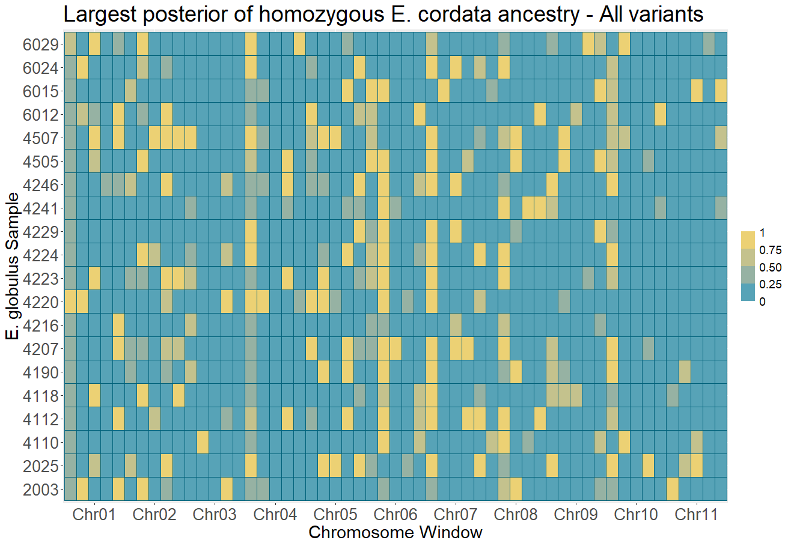
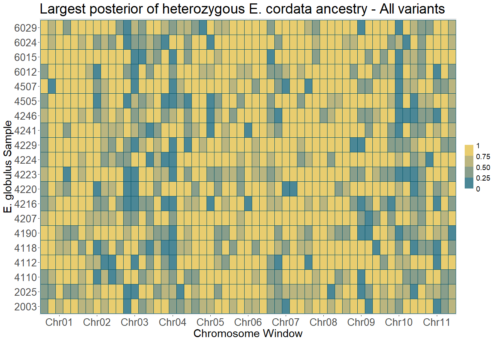
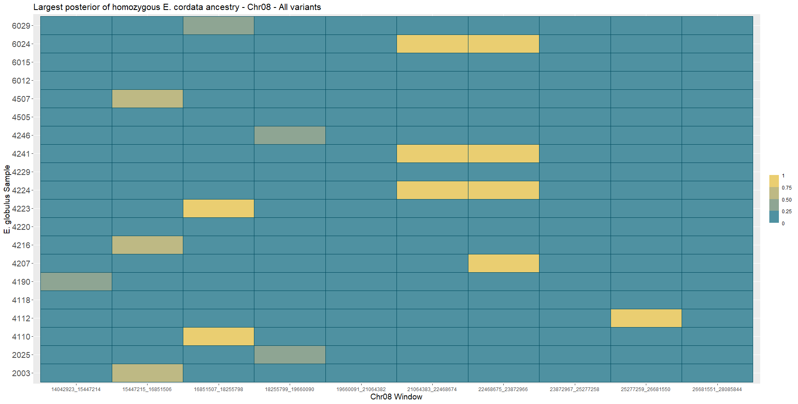
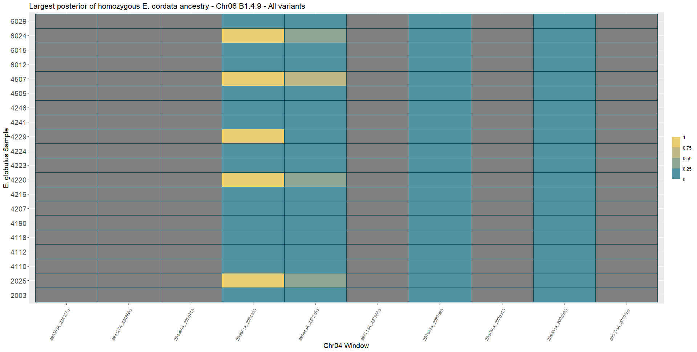
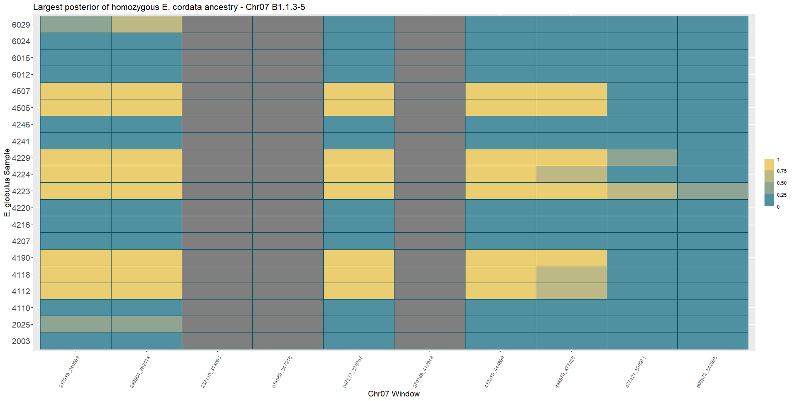
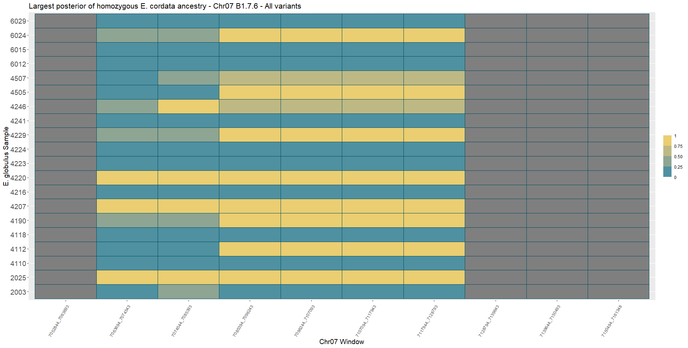
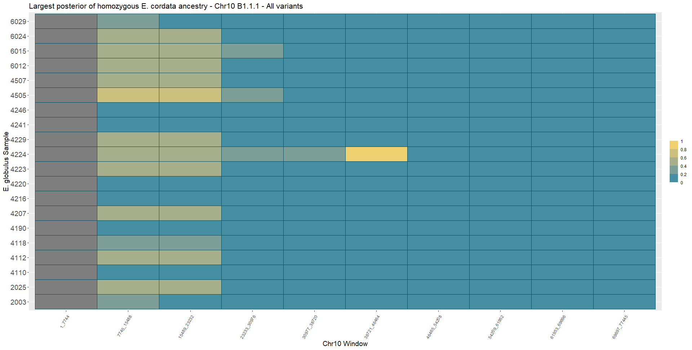

# Visualize windows with inferred posterior > 0.95 E. cordata ancestry for MAF=0.00 run
## Across all chromosomes
Split chromosomes into five chunks each and marked any windows with at least one variant with posterior > 0.95 of homozygous _E. cordata_ ancestry.

```R
library(ggplot2)
library(RColorBrewer)

source("C:/Users/Kasey/OneDrive - University of Florida/Grad School Documents/Projects/eucalyptus-hybrid-resequencing/05.analyses/ancestry_hmm/heatmaps_fun.r")

post_file_loc <- "C:/Users/Kasey/OneDrive - University of Florida/Grad School Documents/Projects/eucalyptus-hybrid-resequencing/05.analyses/ancestry_hmm/maf00/posteriors"
wdir <- "C:/Users/Kasey/OneDrive - University of Florida/Grad School Documents/Projects/eucalyptus-hybrid-resequencing/05.analyses/ancestry_hmm/maf00/heatmaps"
glob_mr_samples <- c("WA01", "WA03", "WA04", "WB02", "WB03", "WB04", "WC02", "WC03", "WC05", "WD04", "WE02", "WE03", "WE04", "WE05", "WF01", "WG03", "WG04", "WG05", "WH03", "WH04")
chromosomes <- c("Chr01", "Chr02", "Chr03", "Chr04", "Chr05", "Chr06", "Chr07", "Chr08", "Chr09", "Chr10", "Chr11")

setwd(wdir)
coarsewin_filename <- "C:/Users/Kasey/OneDrive - University of Florida/Grad School Documents/Projects/eucalyptus-hybrid-resequencing/05.analyses/ancestry_hmm/coarse_windows.csv"
coarsewin_tab <- read.csv(coarsewin_filename, header = FALSE, col.names = c("chrom", "start", "end"), colClasses = c("character", "integer", "integer"))

# populate matrix
coarse_mat_df <- populate_mat_val(glob_mr_samples, coarsewin_tab, post_file_loc)

# plot heatmaps
x_axis_breaks <- c("Chr01_16887823_25331733", "Chr02_20331353_30497028", "Chr03_26218899_39328347", "Chr04_15439735_23159601"
, "Chr05_25167991_37751985", "Chr06_20856265_31284396", "Chr07_21701053_32551578", "Chr08_28085845_42128766", "Chr09_15320131_22980195", "Chr10_15489065_23233596", "Chr11_16822585_25233876")

name_table_name <- "C:/Users/Kasey/OneDrive - University of Florida/Grad School Documents/Projects/eucalyptus-hybrid-resequencing/00.metadata/03.seq_analysis/sample_spp_table.csv"
name_table <- read.csv(name_table_name, header = TRUE, as.is = TRUE)
label_order <- match(coarse_mat_df$sample, name_table$RAPiD_ID)
coarse_mat_df$acc <- name_table$Accession[label_order]

hom_coarse <- ggplot(coarse_mat_df, aes(window, acc, fill = hom_mat)) + 
              geom_tile(color = "#00617a") + 
              scale_fill_steps(high = "#ffd966", low = "#0a9cc1") + 
              guides(fill = guide_coloursteps(title = NULL, show.limits = TRUE)) +
              ggtitle("Largest posterior of homozygous E. cordata ancestry - All variants") + 
              xlab("Chromosome Window") + ylab("E. globulus Sample") + 
              scale_x_discrete(breaks = x_axis_breaks, labels = chromosomes) +
              theme(text=element_text(size=16))
# plot with big labels
hom_coarse + theme(axis.text=element_text(size=20), axis.title=element_text(size=22), plot.title=element_text(size=28), legend.text=element_text(size=14), legend.title=element_text(size=18))
# for display
png("genwide_maf00_hom_display.png", width = 5000, height = 1750)
print(hom_coarse +
      theme(axis.text = element_text(size = 70),
            axis.title = element_text(size = 78),
            plot.title = element_text(size = 95),
            legend.text = element_text(size = 45),
            legend.title = element_text(size = 50),
            legend.key.size = unit(3, "cm"))
      )
dev.off()

het_coarse <- ggplot(coarse_mat_df, aes(window, acc, fill = het_mat)) + 
              geom_tile(color = "#005267") + 
              scale_fill_steps(high = "#ffd966", low = "#007c9b") + 
              guides(fill = guide_coloursteps(title = NULL, show.limits = TRUE)) +
              ggtitle("Largest posterior of heterozygous E. cordata ancestry - All variants") + 
              xlab("Chromosome Window") + ylab("E. globulus Sample") + 
              scale_x_discrete(breaks = x_axis_breaks, labels = chromosomes) +
              theme(text=element_text(size=16))
# plot with big labels
het_coarse + theme(axis.text=element_text(size=20), axis.title=element_text(size=22), plot.title=element_text(size=28), legend.text=element_text(size=14), legend.title=element_text(size=18))
```





Blocks of interest for homozygous _E. cordata_ ancestry at the following based on sharing between individuals:

| Chromosome | Start (bp)  | End (bp)    |
| ---------- | ----------- | ----------- |
| Chr04      | 1           | 7,719,867   |
| Chr06      | 10,428,133  | 20,856,264  |
| Chr07      | 1           | 10,850,526  |
| Chr08      | 14,042,923  | 28,085,844  |
| Chr10      | 1           | 7,744,532   |

Performed Chi-square test on whether distribution of homozygous introgressed regions are distributed non-randomly with regards to window.

```R
library(tidyr)
coarse_pa_mat <- pivot_wider(coarse_mat_df[, c("window", "hom_mat", "acc")], names_from = window, values_from = hom_mat, id_cols = acc)
coarse_contingency <- apply(coarse_pa_mat[,c(2:ncol(coarse_pa_mat))], 2, sum)
coarse_chisq <- chisq.test(coarse_contingency)
```

df = 54
p-val = 4.347e-08

There is very little chance that the homozygous _E. cordata_ ancestry blocks are distributed randomly with regard to window among individuals for the largest windows (~10 056Mb).

## Chromosome-by-chromosome splits

Split blocks of interest into finer windows.

```R
library(ggplot2)

# Chromosome 4, Block 1
chr04b1_tab <- get_windows("Chr04", 1, 7719867, 10)
chr04b1_df <- populate_mat_val(glob_mr_samples, chr04b1_tab, post_file_loc)
chr04b1_plots <- plot_heatmap(chr04b1_df, name_table$RAPiD_ID, name_table$Accession, "Chr04", "- Chr04 - All variants")
chr04b1_plots$hom_plot

# Chromosome 6, Block 2
chr06b2_tab <- get_windows("Chr06", 10428133, 20856264, 10)
chr06b2_df <- populate_mat_val(glob_mr_samples, chr06b2_tab, post_file_loc)
chr06b2_plots <- plot_heatmap(chr06b2_df, name_table$RAPiD_ID, name_table$Accession, "Chr06", "- Chr06 - All variants")
chr06b2_plots$hom_plot

# Chromosome 7, Block 1
chr07b1_tab <- get_windows("Chr07", 1, 10850526, 10)
chr07b1_df <- populate_mat_val(glob_mr_samples, chr07b1_tab, post_file_loc)
chr07b1_plots <- plot_heatmap(chr07b1_df, name_table$RAPiD_ID, name_table$Accession, "Chr07", "- Chr07 - All variants")
chr07b1_plots$hom_plot

# Chromosome 8, Block 2
chr08b2_tab <- get_windows("Chr08", 14042923, 28085844, 10)
chr08b2_df <- populate_mat_val(glob_mr_samples, chr08b2_tab, post_file_loc)
chr08b2_plots <- plot_heatmap(chr08b2_df, name_table$RAPiD_ID, name_table$Accession, "Chr08", "- Chr08 - All variants")
chr08b2_plots$hom_plot
# for display
chr08_axis_labs <- c("14042923", "15447215", "16851507", "18255799", "19660091", "21064383", "22468675", "23872967", "25277259", "26681551")
png("chr8b2_maf00_hom_display.png", width = 1100, height = 1000)
print(chr08b2_plots$hom_plot +
      ggtitle("Chr8 Block 2") +
      scale_x_discrete(breaks = c("Chr08_14042923_15447214", "Chr08_26681551_28085844"),
                       labels = c("14042923", "28085844")) +
      theme(axis.text.x = element_text(size = 40),
            axis.text.y = element_text(size = 30),
            axis.title = element_text(size = 40),
            plot.title = element_text(size = 60),
            # legend.text = element_text(size = 30),
            # legend.title = element_text(size = 36),
            legend.position = "none",
            legend.key.size = unit(2, "cm"),
            plot.margin = margin(1,1,1,1, "cm")))
dev.off()


# Chromosome 10, Block 1
chr10b1_tab <- get_windows("Chr10", 1, 7744532, 10)
chr10b1_df <- populate_mat_val(glob_mr_samples, chr10b1_tab, post_file_loc)
chr10b1_plots <- plot_heatmap(chr10b1_df, name_table$RAPiD_ID, name_table$Accession, "Chr10", "- Chr10 - All variants")
chr10b1_plots$hom_plot
```

The high posterior regions in Chr08 do not line up when zooming in to Block 2.


Blocks of interest for homozygous _E. cordata_ ancestry at the following based on sharing between individuals:

| Chromosome | Start (bp)  | End (bp)    |
| ---------- | ----------- | ----------- |
| Chr04      | 2,315,962   | 3,087,948   |
| Chr06      | 12,513,761  | 13,556,574  |
| Chr07      | 1           | 1,085,053   |
| Chr07      | 6,510,319   | 7,595,371   |
| Chr10      | 1           | 774,453     |

Plotted zoomed shared blocks, split again.

```R
library(ggplot2)
# Chromosome 4 Block 1.4
chr04b1_4_tab <- get_windows("Chr04", 2315962, 3087948, 10)
chr04b1_4_df <- populate_mat_val(glob_mr_samples, chr04b1_4_tab, post_file_loc)
chr04b1_4_plots <- plot_heatmap(chr04b1_4_df, name_table$RAPiD_ID, name_table$Accession, "Chr04", "- Chr06 B1.4 - All variants")
chr04b1_4_plots$hom_plot + theme(axis.text.x = element_text(angle = 60, vjust = 0.95, hjust=1))

# Chromosome 6 Block 2.3
chr06b2_3_tab <- get_windows("Chr06", 12513761, 13556574, 10)
chr06b2_3_df <- populate_mat_val(glob_mr_samples, chr06b2_3_tab, post_file_loc)
chr06b2_3_plots <- plot_heatmap(chr06b2_3_df, name_table$RAPiD_ID, name_table$Accession, "Chr06", "- Chr06 B2.3 - All variants")
chr06b2_3_plots$hom_plot + theme(axis.text.x = element_text(angle = 60, vjust = 0.95, hjust=1))

# Chromosome 7 Block 1.1
chr07b1_1_tab <- get_windows("Chr07", 1, 1085053, 10)
chr07b1_1_df <- populate_mat_val(glob_mr_samples, chr07b1_1_tab, post_file_loc)
chr07b1_1_plots <- plot_heatmap(chr07b1_1_df, name_table$RAPiD_ID, name_table$Accession, "Chr07", "- Chr07 B1.1 - All variants")
chr07b1_1_plots$hom_plot + theme(axis.text.x = element_text(angle = 60, vjust = 0.95, hjust=1))

# Chromosome 7 Block 1.7
chr07b1_7_tab <- get_windows("Chr07", 6510319, 7595371, 10)
chr07b1_7_df <- populate_mat_val(glob_mr_samples, chr07b1_7_tab, post_file_loc)
chr07b1_7_plots <- plot_heatmap(chr07b1_7_df, name_table$RAPiD_ID, name_table$Accession, "Chr07", "- Chr07 B1.7 - All variants")
chr07b1_7_plots$hom_plot + theme(axis.text.x = element_text(angle = 60, vjust = 0.95, hjust=1))

# Chromosome 10 Block 1.1
chr10b1_1_tab <- get_windows("Chr10", 1, 774453, 10)
chr10b1_1_df <- populate_mat_val(glob_mr_samples, chr10b1_1_tab, post_file_loc)
chr10b1_1_plots <- plot_heatmap(chr10b1_1_df, name_table$RAPiD_ID, name_table$Accession, "Chr10", "- Chr10 B1.1 - All variants")
chr10b1_1_plots$hom_plot + theme(axis.text.x = element_text(angle = 60, vjust = 0.95, hjust=1))
```

| Chromosome | Start (bp)  | End (bp)    |
| ---------- | ----------- | ----------- |
| Chr04      | 2,933,554   | 3,010,752   |
| Chr06      | 13,139,453  | 13,190,593  |
| Chr07      | 217,013     | 542,525     |
| Chr07      | 7,052,844   | 7,161,348   |
| Chr10      | 1           |    77,445   |

Plotted zoomed shared blocks, split again.

```R
library(ggplot2)
# Chromosome 4 Block 4.1.9
chr04b1_4_9_tab <- get_windows("Chr04", 2933554, 3010752, 10)
chr04b1_4_9_df <- populate_mat_val(glob_mr_samples, chr04b1_4_9_tab, post_file_loc)
chr04b1_4_9_plots <- plot_heatmap(chr04b1_4_9_df, name_table$RAPiD_ID, name_table$Accession, "Chr04", "- Chr06 B1.4.9 - All variants")
# all labels
chr04b1_4_9_plots$hom_plot + theme(axis.text.x = element_text(angle = 60, vjust = 0.95, hjust=1))
# for display
chr04_axis_labs <- c("2933554", "2941274", "2948994", "2956714", "2964434", "2972154", "2979874", "2987594", "2995314", "3003034")
png("chr04b1.4.9_maf00_hom_display.png", width = 1100, height = 1000)
print(chr04b1_4_9_plots$hom_plot +
      ggtitle("Chr04 Block 1.4.9") +
      scale_x_discrete(breaks = c("Chr04_2933554_2941273", "Chr04_3003034_3010752"),
                       labels = c("2933554", "3010752")) +
      theme(axis.text.x = element_text(size = 40),
            axis.text.y = element_text(size = 30),
            axis.title = element_text(size = 40),
            plot.title = element_text(size = 60),
            # legend.text = element_text(size = 30),
            # legend.title = element_text(size = 36),
            legend.position = "none",
            legend.key.size = unit(2, "cm"),
            plot.margin = margin(1,1,1,1, "cm")))
dev.off()

# Chromosome 6 Block 2-3-7
chr06b2_3_7_tab <- get_windows("Chr06", 13139453, 13190593, 10)
chr06b2_3_7_df <- populate_mat_val(glob_mr_samples, chr06b2_3_7_tab, post_file_loc)
chr06b2_3_7_plots <- plot_heatmap(chr06b2_3_7_df, name_table$RAPiD_ID, name_table$Accession, "Chr06", "- Chr06 B2.3.7 - All variants")
# all labels
chr06b2_3_7_plots$hom_plot + theme(axis.text.x = element_text(angle = 60, vjust = 0.95, hjust=1))
# for display
chr06_axis_labs <- c("13139453", "13144567", "13149681", "13154795", "13159909", "13165023", "13170137", "13175251", "13180365", "13185479")
png("chr06b2.3.7_maf00_hom_display.png", width = 1100, height = 1000)
print(chr06b2_3_7_plots$hom_plot +
      ggtitle("Chr06 Block 2.3.7") +
      scale_x_discrete(breaks = c("Chr06_13139453_13144566", "Chr06_13185479_13190593"),
                       labels = c("13139453", "28085844")) +
      theme(axis.text.x = element_text(size = 40),
            axis.text.y = element_text(size = 30),
            axis.title = element_text(size = 40),
            plot.title = element_text(size = 60),
            # legend.text = element_text(size = 30),
            # legend.title = element_text(size = 36),
            legend.position = "none",
            legend.key.size = unit(2, "cm"),
            plot.margin = margin(1,1,1,1, "cm")))
dev.off()

# Chromosome 7 Block 1.1.35
chr07b1_1_35_tab <- get_windows("Chr07", 217013, 542525, 10)
chr07b1_1_35_df <- populate_mat_val(glob_mr_samples, chr07b1_1_35_tab, post_file_loc)
chr07b1_1_35_plots <- plot_heatmap(chr07b1_1_35_df, name_table$RAPiD_ID, name_table$Accession, "Chr07", "- Chr07 B1.1.3-5")
# all labels
chr07b1_1_35_plots$hom_plot + theme(axis.text.x = element_text(angle = 60, vjust = 0.95, hjust=1))
# for display
chr07b11_axis_labs <- c("217013", "249564", "282115", "314666", "347217", "379768", "412319", "444870", "477421", "509972")
png("chr07b1.1.35_maf00_hom_display.png", width = 1100, height = 1000)
print(chr07b1_1_35_plots$hom_plot +
      ggtitle("Chr07 Block 1.1.3-5") +
      scale_x_discrete(breaks = c("Chr07_217013_249563", "Chr07_509972_542525"),
                       labels = c("217013", "542525")) +
      theme(axis.text.x = element_text(size = 40),
            axis.text.y = element_text(size = 30),
            axis.title = element_text(size = 40),
            plot.title = element_text(size = 60),
            # legend.text = element_text(size = 30),
            # legend.title = element_text(size = 36),
            legend.position = "none",
            legend.key.size = unit(2, "cm"),
            plot.margin = margin(1,1,1,1, "cm")))
dev.off()

# Chromosome 7 Block 1.7.6
chr07b1_7_6_tab <- get_windows("Chr07", 7052844, 7161348, 10)
chr07b1_7_6_df <- populate_mat_val(glob_mr_samples, chr07b1_7_6_tab, post_file_loc)
chr07b1_7_6_plots <- plot_heatmap(chr07b1_7_6_df, name_table$RAPiD_ID, name_table$Accession, "Chr07", "- Chr07 B1.7.6 - All variants")
# all labels
chr07b1_7_6_plots$hom_plot + theme(axis.text.x = element_text(angle = 60, vjust = 0.95, hjust=1))
# for display
chr07b17_axis_labs <- c("7052844", "7063694", "7074544", "7085394", "7096244", "7107094", "7117944", "7128794", "7139644", "7150494")
png("chr07b1.7.6_maf00_hom_display.png", width = 1100, height = 1000)
print(chr07b1_7_6_plots$hom_plot +
      ggtitle("Chr07 Block 1.7.6") +
      scale_x_discrete(breaks = c("Chr07_7052844_7063693", "Chr07_7150494_7161348"),
                       labels = c("7052844", "7161348")) +
      theme(axis.text.x = element_text(size = 40),
            axis.text.y = element_text(size = 30),
            axis.title = element_text(size = 40),
            plot.title = element_text(size = 60),
            # legend.text = element_text(size = 30),
            # legend.title = element_text(size = 36),
            legend.position = "none",
            legend.key.size = unit(2, "cm"),
            plot.margin = margin(1,1,1,1, "cm")))
dev.off()

# Chromosome 10 Block 1.1.1
chr10b1_1_1_tab <- get_windows("Chr10", 1, 77445, 10)
chr10b1_1_1_df <- populate_mat_val(glob_mr_samples, chr10b1_1_1_tab, post_file_loc)
chr10b1_1_1_plots <- plot_heatmap(chr10b1_1_1_df, name_table$RAPiD_ID, name_table$Accession, "Chr10", "- Chr10 B1.1.1 - All variants")
# all labels
chr10b1_1_1_plots$hom_plot + theme(axis.text.x = element_text(angle = 60, vjust = 0.95, hjust=1))
# for display
chr10_axis_labs <- c("1", "7745", "15489", "23233", "30977", "38721", "46465", "54209", "61953", "69697")
png("chr10b1.1.1_maf00_hom_display.png", width = 1100, height = 1000)
print(chr10b1_1_1_plots$hom_plot +
      ggtitle("Chr10 Block 1.1.1") +
      scale_x_discrete(breaks = c("Chr10_1_7744", "Chr10_69697_77445"),
                       labels = c("1", "77445")) +
      theme(axis.text.x = element_text(size = 40),
            axis.text.y = element_text(size = 30),
            axis.title = element_text(size = 40),
            plot.title = element_text(size = 60),
            # legend.text = element_text(size = 30),
            # legend.title = element_text(size = 36),
            legend.position = "none",
            legend.key.size = unit(2, "cm"),
            plot.margin = margin(1,1,1,1, "cm")))
dev.off()
```










Final intervals to investigate further:

| Chromosome | Start (bp)  | End (bp)    |
| ---------- | ----------- | ----------- |
| Chr04      |  2,956,714  |  2,964,433  |
| Chr06      | 13,144,567  | 13,180,364  |
| Chr07      |    217,013  |    477,420  |
| Chr07      |  7,074,553  |  7,123,386  |
| Chr10      |     7,745   |    23,232   |  
