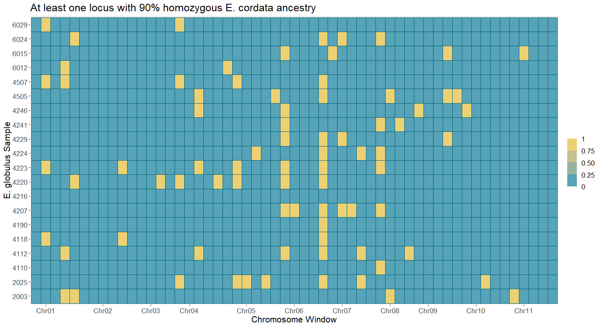
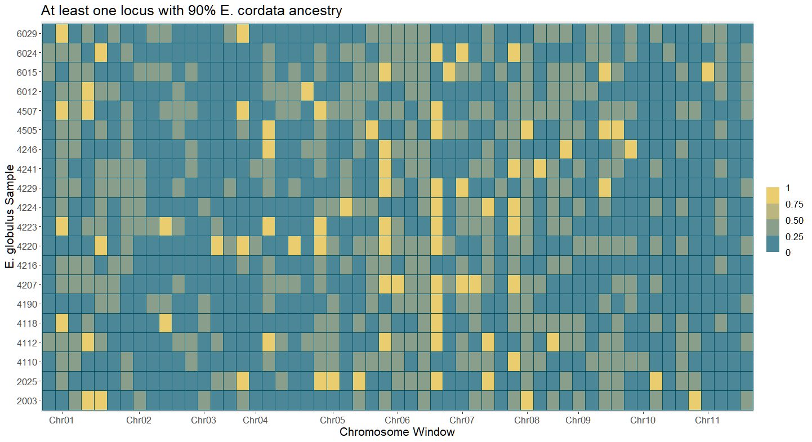
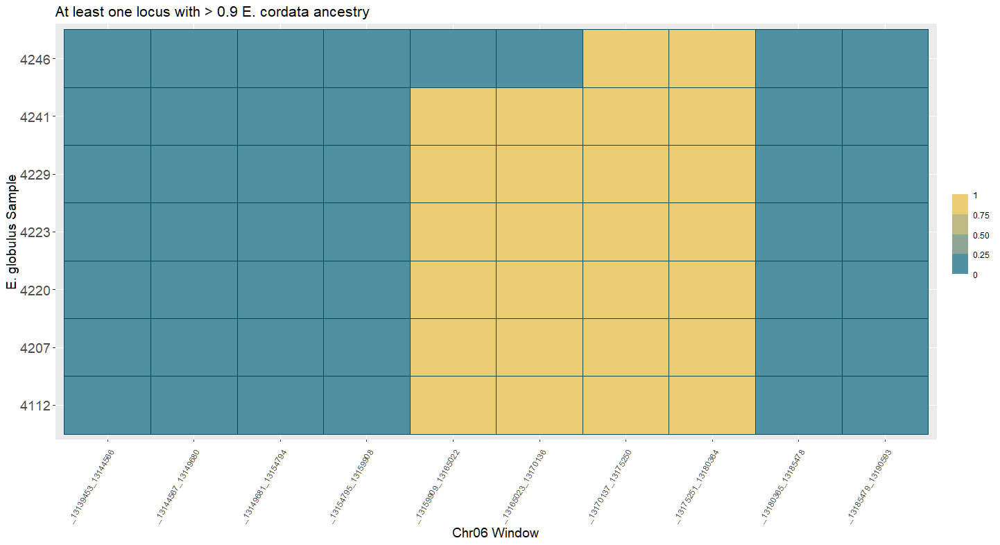
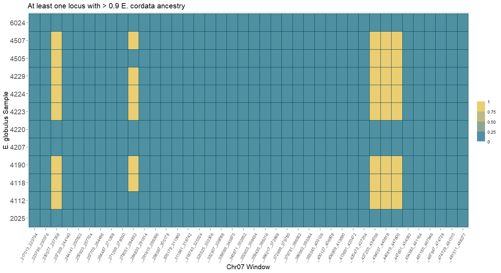
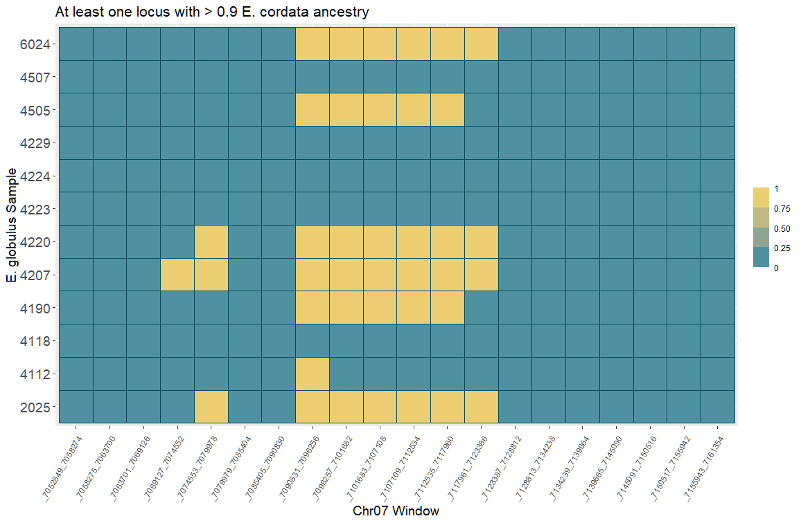
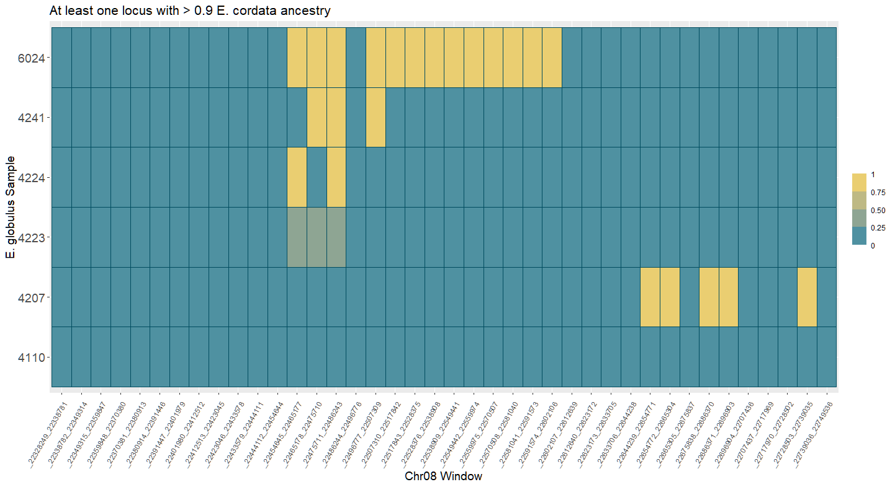

# Visualize windows with inferred posterior > 0.90 E. cordata ancestry

Split chromosomes into 5 sections each and plotted presence/absence of heterozygous and homozygous _cordata_ loci above 90% posterior probability.

## Across all chromosomes

Split chromosomes into five chunks each and marked any windows with at least one variant with posterior > 0.95 of homozygous _E. cordata_ ancestry.

```R
library(ggplot2)
library(RColorBrewer)

source("C:/Users/Kasey/OneDrive - University of Florida/Grad School Documents/Projects/eucalyptus-hybrid-resequencing/05.analyses/ancestry_hmm/heatmaps_fun.r")

post_file_loc <- "C:/Users/Kasey/OneDrive - University of Florida/Grad School Documents/Projects/eucalyptus-hybrid-resequencing/05.analyses/ancestry_hmm/maf00/posteriors"
wdir <- "C:/Users/Kasey/OneDrive - University of Florida/Grad School Documents/Projects/eucalyptus-hybrid-resequencing/05.analyses/ancestry_hmm/maf00/heatmaps/p0.90"
glob_mr_samples <- c("WA01", "WA03", "WA04", "WB02", "WB03", "WB04", "WC02", "WC03", "WC05", "WD04", "WE02", "WE03", "WE04", "WE05", "WF01", "WG03", "WG04", "WG05", "WH03", "WH04")
chromosomes <- c("Chr01", "Chr02", "Chr03", "Chr04", "Chr05", "Chr06", "Chr07", "Chr08", "Chr09", "Chr10", "Chr11")

setwd(wdir)
coarsewin_filename <- "C:/Users/Kasey/OneDrive - University of Florida/Grad School Documents/Projects/eucalyptus-hybrid-resequencing/05.analyses/ancestry_hmm/maf00/heatmaps/coarse_windows.csv"
coarsewin_tab <- read.csv(coarsewin_filename, header = FALSE, col.names = c("chrom", "start", "end"), colClasses = c("character", "integer", "integer"))

# populate matrix
coarse_mat_df <- populate_mat(glob_mr_samples, coarsewin_tab, 0.90)

# plot heatmaps
x_axis_breaks <- c("Chr01_16887823_25331733", "Chr02_20331353_30497028", "Chr03_26218899_39328347", "Chr04_15439735_23159601"
, "Chr05_25167991_37751985", "Chr06_20856265_31284396", "Chr07_21701053_32551578", "Chr08_28085845_42128766", "Chr09_15320131_22980195", "Chr10_15489065_23233596", "Chr11_16822585_25233876")

name_table_name <- "C:/Users/Kasey/OneDrive - University of Florida/Grad School Documents/Projects/eucalyptus-hybrid-resequencing/00.metadata/03.seq_analysis/sample_spp_table.csv"
name_table <- read.csv(name_table_name, header = TRUE, as.is = TRUE)
label_order <- match(coarse_mat_df$sample, name_table$RAPiD_ID)
coarse_mat_df$acc <- name_table$Accession[label_order]

hom_coarse <- ggplot(coarse_mat_df, aes(window, acc, fill = hom_mat)) + 
              geom_tile(color = "#00617a") + 
              scale_fill_steps(high = "#ffd966", low = "#0a9cc1") + 
              guides(fill = guide_coloursteps(title = NULL, show.limits = TRUE)) +
              ggtitle("At least one locus with 90% homozygous E. cordata ancestry") + 
              xlab("Chromosome Window") + ylab("E. globulus Sample") + 
              scale_x_discrete(breaks = x_axis_breaks, labels = chromosomes) +
              theme(text=element_text(size=16))
hom_coarse

het_coarse <- ggplot(coarse_mat_df, aes(window, acc, fill = het_mat)) + 
              geom_tile(color = "#005267") + 
              scale_fill_steps(high = "#ffd966", low = "#007c9b") + 
              guides(fill = guide_coloursteps(title = NULL, show.limits = TRUE)) +
              ggtitle("At least one locus with 90% E. cordata ancestry") + 
              xlab("Chromosome Window") + ylab("E. globulus Sample") + 
              scale_x_discrete(breaks = x_axis_breaks, labels = chromosomes) +
              theme(text=element_text(size=16))
het_coarse
```





```R
# Chromosome 6, Block 2
chr06b2_samples <- c("WG05", "WC03", "WC02", "WB04", "WE04", "WH03", "WF01")
chr06b2_filename_rel <- "chr06_block2_windows.csv"
chr06b2_filename <- paste(wdir, chr06b2_filename_rel, sep = "/")
chr06b2_tab <- read.csv(chr06b2_filename, header = FALSE, col.names = c("chrom", "start", "end"), colClasses = c("character", "integer", "integer"))
chr06b2_df <- populate_mat(chr06b2_samples, chr06b2_tab, 0.90)

chr06b2_plots <- plot_heatmap(chr06b2_df, name_table$RAPiD_ID, name_table$Accession, "Chr06", 0.90)
chr06b2_plots$het_plot

# Chromosome 7, Block 1
chr07b1_samples <- c("WB02", "WH04", "WG03", "WC03", "WE02", "WC02", "WB04", "WE04", "WA01", "WA04", "WH03", "WG04")
chr07b1_filename_rel <- "chr07_block1_windows.csv"
chr07b1_filename <- paste(wdir, chr07b1_filename_rel, sep = "/")
chr07b1_tab <- read.csv(chr07b1_filename, header = FALSE, col.names = c("chrom", "start", "end"), colClasses = c("character", "integer", "integer"))
chr07b1_df <- populate_mat(chr07b1_samples, chr07b1_tab, 0.90)

chr07b1_plots <- plot_heatmap(chr07b1_df, name_table$RAPiD_ID, name_table$Accession, "Chr07", 0.90)
chr07b1_plots$het_plot

# Chromosome 8, Block 2
chr08b2_samples <- c("WB02", "WG05", "WE02", "WC02", "WE04", "WE03")
chr08b2_filename_rel <- "chr08_block2_windows.csv"
chr08b2_filename <- paste(wdir, chr08b2_filename_rel, sep = "/")
chr08b2_tab <- read.csv(chr08b2_filename, header = FALSE, col.names = c("chrom", "start", "end"), colClasses = c("character", "integer", "integer"))
chr08b2_df <- populate_mat(chr08b2_samples, chr08b2_tab, 0.90)

chr08b2_plots <- plot_heatmap(chr08b2_df, name_table$RAPiD_ID, name_table$Accession, "Chr08", 0.90)
chr08b2_plots$het_plot
```

```R
library(ggplot2)

# Chromosome 6 Block 2-3-13
chr06b2_3_13_filename_rel <- "chr06_block2-3-13_windows.csv"
chr06b2_3_13_filename <- paste(wdir, chr06b2_3_13_filename_rel, sep = "/")
chr06b2_3_13_tab <- read.csv(chr06b2_3_13_filename, header = FALSE, col.names = c("chrom", "start", "end"), colClasses = c("character", "integer", "integer"))
chr06b2_3_13_df <- populate_mat(chr06b2_samples, chr06b2_3_13_tab, 0.90)

chr06b2_3_13_plots <- plot_heatmap(chr06b2_3_13_df, name_table$RAPiD_ID, name_table$Accession, "Chr06", 0.90)
chr06b2_3_13_plots$het_plot + theme(axis.text.x = element_text(angle = 60, vjust = 0.95, hjust=1))

# Chromosome 7 Block 1-1-59
chr07b1_1_59_filename_rel <- "chr07_block1-1-59_windows.csv"
chr07b1_1_59_filename <- paste(wdir, chr07b1_1_59_filename_rel, sep = "/")
chr07b1_1_59_tab <- read.csv(chr07b1_1_59_filename, header = FALSE, col.names = c("chrom", "start", "end"), colClasses = c("character", "integer", "integer"))
chr07b1_1_59_df <- populate_mat(chr07b1_samples, chr07b1_1_59_tab, 0.90)

chr07b1_1_59_plots <- plot_heatmap(chr07b1_1_59_df, name_table$RAPiD_ID, name_table$Accession, "Chr07", 0.90)
chr07b1_1_59_plots$het_plot + theme(axis.text.x = element_text(angle = 60, vjust = 0.95, hjust=1))

# Chromosome 7 Block 1-7-1112
chr07b1_7_1112_filename_rel <- "chr07_block1-7-1112_windows.csv"
chr07b1_7_1112_filename <- paste(wdir, chr07b1_7_1112_filename_rel, sep = "/")
chr07b1_7_1112_tab <- read.csv(chr07b1_7_1112_filename, header = FALSE, col.names = c("chrom", "start", "end"), colClasses = c("character", "integer", "integer"))
chr07b1_7_1112_df <- populate_mat(chr07b1_samples, chr07b1_7_1112_tab, 0.90)

chr07b1_7_1112_plots <- plot_heatmap(chr07b1_7_1112_df, name_table$RAPiD_ID, name_table$Accession, "Chr07", 0.90)
chr07b1_7_1112_plots$het_plot + theme(axis.text.x = element_text(angle = 60, vjust = 0.95, hjust=1))

# Chromosome 8 Block 2-67
chr08b2_67_1012_filename_rel <- "chr08_block2-67-1012_windows.csv"
chr08b2_67_1012_filename <- paste(wdir, chr08b2_67_1012_filename_rel, sep = "/")
chr08b2_67_1012_tab <- read.csv(chr08b2_67_1012_filename, header = FALSE, col.names = c("chrom", "start", "end"), colClasses = c("character", "integer", "integer"))
chr08b2_67_1012_df <- populate_mat(chr08b2_samples, chr08b2_67_1012_tab, 0.90)

chr08b2_67_1012_plots <- plot_heatmap(chr08b2_67_1012_df, name_table$RAPiD_ID, name_table$Accession, "Chr08", 0.90)
chr08b2_67_1012_plots$het_plot + theme(axis.text.x = element_text(angle = 60, vjust = 0.95, hjust=1))
```









A few blocks are expanded in specific individuals, but overall, the pattern for a posterior cutoff of 0.90 is the same as for 0.95.