# Visualize windows with inferred posterior > 0.95 E. cordata ancestry for MAF=0.00 run

Split chromosomes into 5 sections each and plotted presence/absence of heterozygous and homozygous _cordata_ loci above 95% posterior probability.

## Across all chromosomes

Split chromosomes into five chunks each and marked any windows with at least one variant with posterior > 0.95 of homozygous _E. cordata_ ancestry.

```R
library(ggplot2)
library(RColorBrewer)

source("C:/Users/Kasey/OneDrive - University of Florida/Grad School Documents/Projects/eucalyptus-hybrid-resequencing/05.analyses/ancestry_hmm/heatmaps_fun.r")

post_file_loc <- "C:/Users/Kasey/OneDrive - University of Florida/Grad School Documents/Projects/eucalyptus-hybrid-resequencing/05.analyses/ancestry_hmm/maf00/posteriors"
wdir <- "C:/Users/Kasey/OneDrive - University of Florida/Grad School Documents/Projects/eucalyptus-hybrid-resequencing/05.analyses/ancestry_hmm/maf00/heatmaps/p0.95"
glob_mr_samples <- c("WA01", "WA03", "WA04", "WB02", "WB03", "WB04", "WC02", "WC03", "WC05", "WD04", "WE02", "WE03", "WE04", "WE05", "WF01", "WG03", "WG04", "WG05", "WH03", "WH04")
chromosomes <- c("Chr01", "Chr02", "Chr03", "Chr04", "Chr05", "Chr06", "Chr07", "Chr08", "Chr09", "Chr10", "Chr11")

setwd(wdir)
coarsewin_filename <- "C:/Users/Kasey/OneDrive - University of Florida/Grad School Documents/Projects/eucalyptus-hybrid-resequencing/05.analyses/ancestry_hmm/maf00/heatmaps/coarse_windows.csv"
coarsewin_tab <- read.csv(coarsewin_filename, header = FALSE, col.names = c("chrom", "start", "end"), colClasses = c("character", "integer", "integer"))

# populate matrix
coarse_mat_df <- populate_mat(glob_mr_samples, coarsewin_tab, 0.95)

# plot heatmaps
x_axis_breaks <- c("Chr01_16887823_25331733", "Chr02_20331353_30497028", "Chr03_26218899_39328347", "Chr04_15439735_23159601"
, "Chr05_25167991_37751985", "Chr06_20856265_31284396", "Chr07_21701053_32551578", "Chr08_28085845_42128766", "Chr09_15320131_22980195", "Chr10_15489065_23233596", "Chr11_16822585_25233876")

name_table_name <- "C:/Users/Kasey/OneDrive - University of Florida/Grad School Documents/Projects/eucalyptus-hybrid-resequencing/00.metadata/03.seq_analysis/sample_spp_table.csv"
name_table <- read.csv(name_table_name, header = TRUE, as.is = TRUE)
label_order <- match(coarse_mat_df$sample, name_table$RAPiD_ID)
coarse_mat_df$acc <- name_table$Accession[label_order]

hom_coarse <- ggplot(mat_df, aes(window, acc, fill = hom_mat)) + 
              geom_tile(color = "#00617a") + 
              scale_fill_steps(high = "#ffd966", low = "#0a9cc1") + 
              guides(fill = guide_coloursteps(title = NULL, show.limits = TRUE)) +
              ggtitle("At least one locus with 95% homozygous E. cordata ancestry") + 
              xlab("Chromosome Window") + ylab("E. globulus Sample") + 
              scale_x_discrete(breaks = x_axis_breaks, labels = chromosomes) +
              theme(text=element_text(size=16))
hom_coarse

het_coarse <- ggplot(mat_df, aes(window, acc, fill = het_mat)) + 
              geom_tile(color = "#005267") + 
              scale_fill_steps(high = "#ffd966", low = "#007c9b") + 
              guides(fill = guide_coloursteps(title = NULL, show.limits = TRUE)) +
              ggtitle("At least one locus with 95% E. cordata ancestry") + 
              xlab("Chromosome Window") + ylab("E. globulus Sample") + 
              scale_x_discrete(breaks = x_axis_breaks, labels = chromosomes) +
              theme(text=element_text(size=16))
het_coarse

# Plots for July 2023 Talks
hom_coarse + theme(axis.text=element_text(size=20), axis.title=element_text(size=22), plot.title=element_text(size=28), legend.text=element_text(size=14), legend.title=element_text(size=18))
```

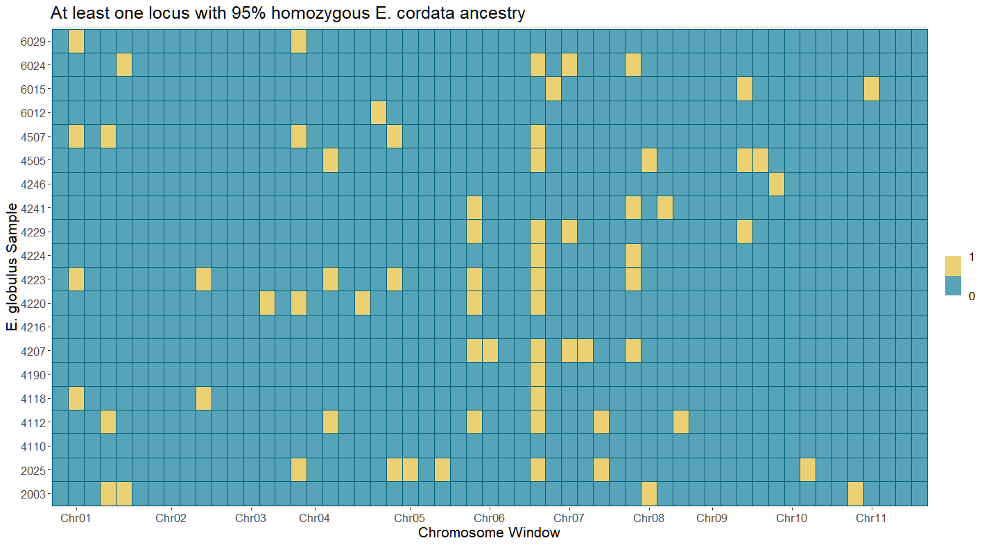

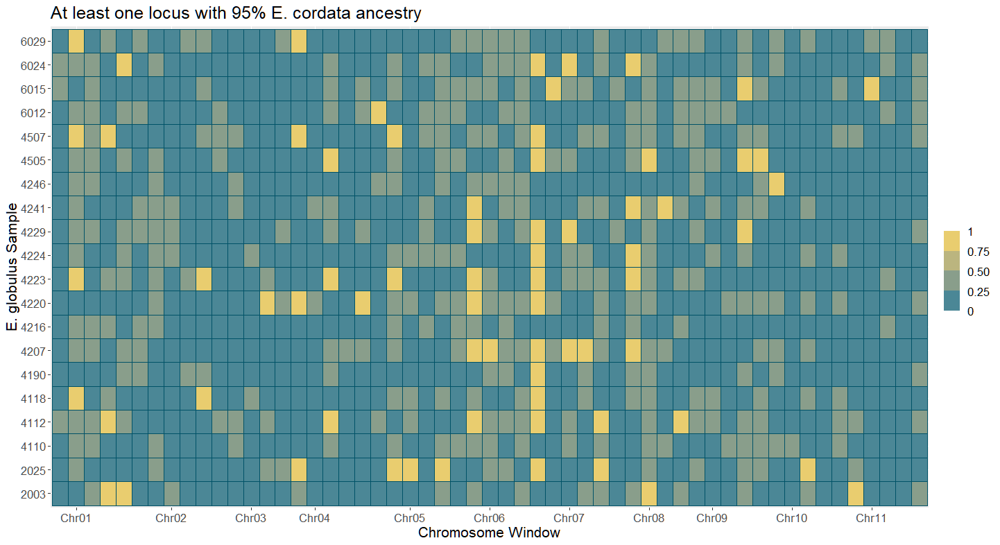

Blocks of interest for homozygous _E. cordata_ ancestry at the following based on sharing between individuals:

| Chromosome | Start (bp)  | End (bp)    |
| ---------- | ----------- | ----------- |
| Chr06      | 10,428,133  | 20,856,264  |
| Chr07      | 1           | 10,850,526  |
| Chr08      | 14,042,923  | 28,085,844  |

Performed Chi-square test on whether distribution of homozygous introgressed regions are distributed non-randomly with regards to window.

```R
library(tidyr)
coarse_pa_mat <- pivot_wider(coarse_mat_df[, c("window", "hom_mat", "acc")], names_from = window, values_from = hom_mat, id_cols = acc)
coarse_contingency <- apply(coarse_pa_mat[,c(2:ncol(coarse_pa_mat))], 2, sum)
coarse_chisq <- chisq.test(coarse_contingency)
```

df = 54
p-val = 1.538e-15

There is very little chance that the homozygous _E. cordata_ ancestry blocks are distributed randomly with regard to window among individuals for the largest windows (~10 056Mb).

## Chromosome-by-chromosome splits

Split blocks of interest into finer windows.

```R
library(ggplot2)

# Chromosome 6, Block 2
chr06b2_samples <- c("WG05", "WC03", "WC02", "WB04", "WE04", "WH03")
chr06b2_filename_rel <- "chr06_block2_windows.csv"
chr06b2_filename <- paste(wdir, chr06b2_filename_rel, sep = "/")
chr06b2_tab <- read.csv(chr06b2_filename, header = FALSE, col.names = c("chrom", "start", "end"), colClasses = c("character", "integer", "integer"))
chr06b2_df <- populate_mat(chr06b2_samples, chr06b2_tab, 0.95)

chr06b2_plots <- plot_heatmap(chr06b2_df, name_table$RAPiD_ID, name_table$Accession, "Chr06", 0.95)
chr06b2_plots$hom_plot
chr06b2_plots$het_plot

# Chromosome 7, Block 1
chr07b1_samples <- c("WB02", "WH04", "WG03", "WC03", "WE02", "WC02", "WB04", "WE04", "WA01", "WA04", "WH03", "WG04")
chr07b1_filename_rel <- "chr07_block1_windows.csv"
chr07b1_filename <- paste(wdir, chr07b1_filename_rel, sep = "/")
chr07b1_tab <- read.csv(chr07b1_filename, header = FALSE, col.names = c("chrom", "start", "end"), colClasses = c("character", "integer", "integer"))
chr07b1_df <- populate_mat(chr07b1_samples, chr07b1_tab, 0.95)

chr07b1_plots <- plot_heatmap(chr07b1_df, name_table$RAPiD_ID, name_table$Accession, "Chr07", 0.95)
chr07b1_plots$hom_plot
chr07b1_plots$het_plot

# Chromosome 8, Block 2
chr08b2_samples <- c("WB02", "WG05", "WE02", "WC02", "WE04")
chr08b2_filename_rel <- "chr08_block2_windows.csv"
chr08b2_filename <- paste(wdir, chr08b2_filename_rel, sep = "/")
chr08b2_tab <- read.csv(chr08b2_filename, header = FALSE, col.names = c("chrom", "start", "end"), colClasses = c("character", "integer", "integer"))
chr08b2_df <- populate_mat(chr08b2_samples, chr08b2_tab, 0.95)

chr08b2_plots <- plot_heatmap(chr08b2_df, name_table$RAPiD_ID, name_table$Accession, "Chr08", 0.95)
chr08b2_plots$hom_plot
chr08b2_plots$het_plot
```

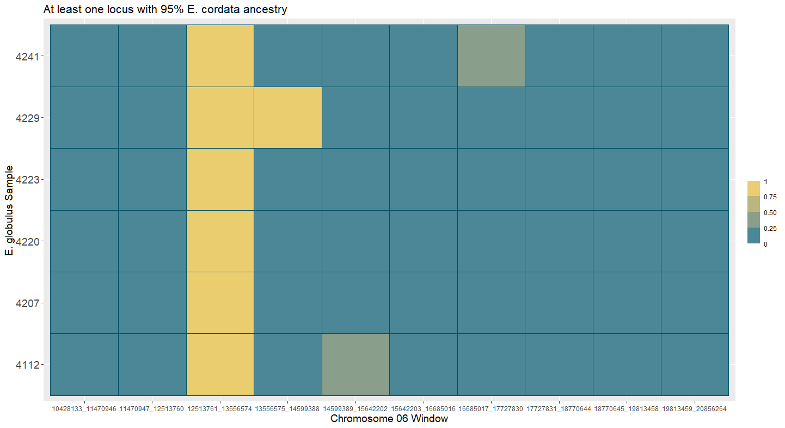

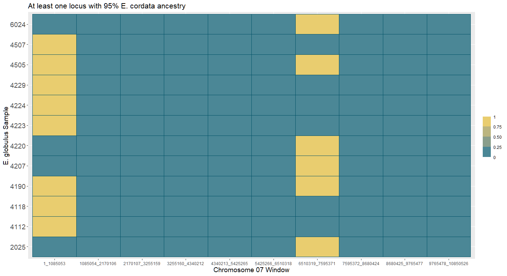

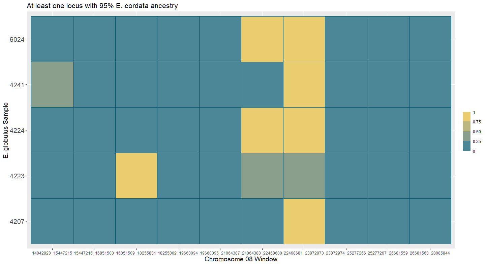

Blocks of interest for homozygous _E. cordata_ ancestry at the following based on sharing between individuals:

| Chromosome | Start (bp)  | End (bp)    |
| ---------- | ----------- | ----------- |
| Chr06      | 12,513,761  | 13,556,574  |
| Chr07      | 1           | 1,085,053   |
| Chr07      | 6,510,319   | 7,595,371   |
| Chr08      | 21,064,388  | 23,872,973  |

Plotted zoomed shared blocks, split again.

```R
library(ggplot2)

# Chromosome 6 Block 2-3
chr06b2_3_filename_rel <- "chr06_block2-3_windows.csv"
chr06b2_3_filename <- paste(wdir, chr06b2_3_filename_rel, sep = "/")
chr06b2_3_tab <- read.csv(chr06b2_3_filename, header = FALSE, col.names = c("chrom", "start", "end"), colClasses = c("character", "integer", "integer"))
chr06b2_3_df <- populate_mat(chr06b2_samples, chr06b2_3_tab, 0.95)

chr06b2_3_plots <- plot_heatmap(chr06b2_3_df, name_table$RAPiD_ID, name_table$Accession, "Chr06", 0.95)
chr06b2_3_plots$het_plot + theme(axis.text.x = element_text(angle = 60, vjust = 0.95, hjust=1))

# Chromosome 7 Block 1-1
chr07b1_1_filename_rel <- "chr07_block1-1_windows.csv"
chr07b1_1_filename <- paste(wdir, chr07b1_1_filename_rel, sep = "/")
chr07b1_1_tab <- read.csv(chr07b1_1_filename, header = FALSE, col.names = c("chrom", "start", "end"), colClasses = c("character", "integer", "integer"))
chr07b1_1_df <- populate_mat(chr07b1_samples, chr07b1_1_tab, 0.95)

chr07b1_1_plots <- plot_heatmap(chr07b1_1_df, name_table$RAPiD_ID, name_table$Accession, "Chr07", 0.95)
chr07b1_1_plots$het_plot + theme(axis.text.x = element_text(angle = 60, vjust = 0.95, hjust=1))

# Chromosome 7 Block 1-7
chr07b1_7_filename_rel <- "chr07_block1-7_windows.csv"
chr07b1_7_filename <- paste(wdir, chr07b1_7_filename_rel, sep = "/")
chr07b1_7_tab <- read.csv(chr07b1_7_filename, header = FALSE, col.names = c("chrom", "start", "end"), colClasses = c("character", "integer", "integer"))
chr07b1_7_df <- populate_mat(chr07b1_samples, chr07b1_7_tab, 0.95)

chr07b1_7_plots <- plot_heatmap(chr07b1_7_df, name_table$RAPiD_ID, name_table$Accession, "Chr07", 0.95)
chr07b1_7_plots$het_plot + theme(axis.text.x = element_text(angle = 60, vjust = 0.95, hjust=1))

# Chromosome 8 Block 2-67
chr08b2_67_filename_rel <- "chr08_block2-67_windows.csv"
chr08b2_67_filename <- paste(wdir, chr08b2_67_filename_rel, sep = "/")
chr08b2_67_tab <- read.csv(chr08b2_67_filename, header = FALSE, col.names = c("chrom", "start", "end"), colClasses = c("character", "integer", "integer"))
chr08b2_67_df <- populate_mat(chr08b2_samples, chr08b2_67_tab, 0.95)

chr08b2_67_plots <- plot_heatmap(chr08b2_67_df, name_table$RAPiD_ID, name_table$Accession, "Chr08", 0.95)
chr08b2_67_plots$het_plot + theme(axis.text.x = element_text(angle = 60, vjust = 0.95, hjust=1))
```

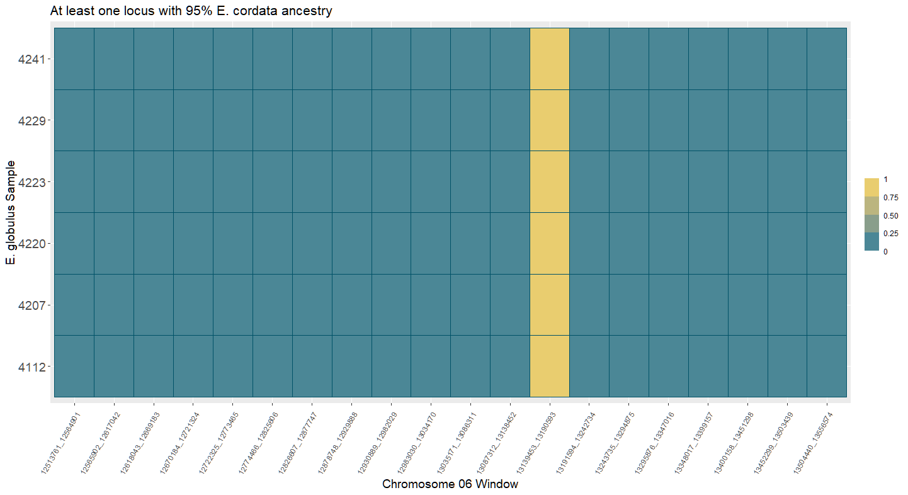

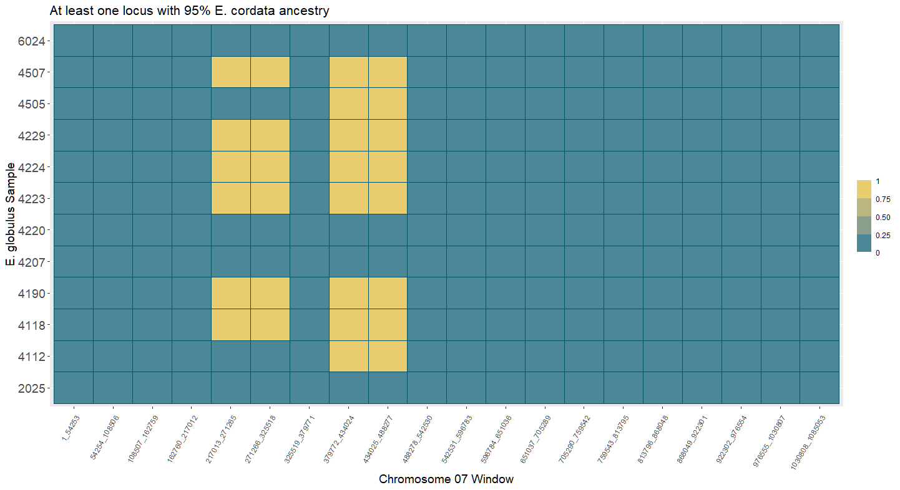

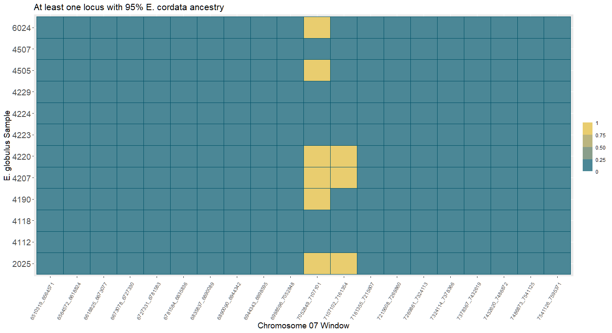

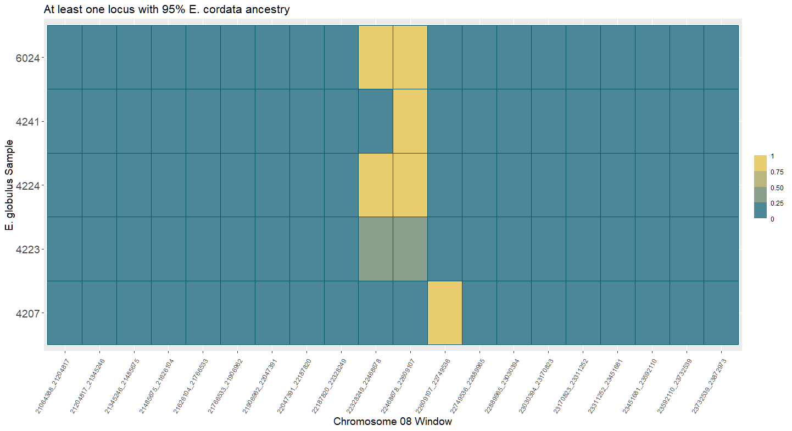

| Chromosome | Start (bp)  | End (bp)    |
| ---------- | ----------- | ----------- |
| Chr06      | 13,139,453  | 13,190,593  |
| Chr07      | 217,013     | 488,277     |
| Chr07      | 7,052,849   | 7,161,354   |
| Chr08      | 22,328,249  | 22,749,536  |

Plotted zoomed shared blocks, split again.

```R
library(ggplot2)

# Chromosome 6 Block 2-3-13
chr06b2_3_13_filename_rel <- "chr06_block2-3-13_windows.csv"
chr06b2_3_13_filename <- paste(wdir, chr06b2_3_13_filename_rel, sep = "/")
chr06b2_3_13_tab <- read.csv(chr06b2_3_13_filename, header = FALSE, col.names = c("chrom", "start", "end"), colClasses = c("character", "integer", "integer"))
chr06b2_3_13_df <- populate_mat(chr06b2_samples, chr06b2_3_13_tab, 0.95)

chr06b2_3_13_plots <- plot_heatmap(chr06b2_3_13_df, name_table$RAPiD_ID, name_table$Accession, "Chr06", 0.95)
chr06b2_3_13_plots$het_plot + theme(axis.text.x = element_text(angle = 60, vjust = 0.95, hjust=1))

# for July 2023 Presentations
chr06b2_3_13_plots$het_plot + scale_x_discrete(breaks = c("Chr06_13139453_13144566", "Chr06_13185479_13190593"), labels = c("13139453", "13190593")) + theme(axis.text=element_text(size=20), axis.title=element_text(size=22), plot.title=element_text(size=28), legend.text=element_text(size=14), legend.title=element_text(size=18))

# Chromosome 7 Block 1-1
chr07b1_1_59_filename_rel <- "chr07_block1-1-59_windows.csv"
chr07b1_1_59_filename <- paste(wdir, chr07b1_1_59_filename_rel, sep = "/")
chr07b1_1_59_tab <- read.csv(chr07b1_1_59_filename, header = FALSE, col.names = c("chrom", "start", "end"), colClasses = c("character", "integer", "integer"))
chr07b1_1_59_df <- populate_mat(chr07b1_samples, chr07b1_1_59_tab, 0.95)

chr07b1_1_59_plots <- plot_heatmap(chr07b1_1_59_df, name_table$RAPiD_ID, name_table$Accession, "Chr07", 0.95)
chr07b1_1_59_plots$het_plot + theme(axis.text.x = element_text(angle = 60, vjust = 0.95, hjust=1))


# for July 2023 Presentations
chr07b1_1_59_plots$het_plot + scale_x_discrete(breaks = c("Chr07_217013_223794", "Chr07_481511_488277"), labels = c("217013", "488277")) + theme(axis.text=element_text(size=20), axis.title=element_text(size=22), plot.title=element_text(size=28), legend.text=element_text(size=14), legend.title=element_text(size=18))

# Chromosome 7 Block 1-7
chr07b1_7_1112_filename_rel <- "chr07_block1-7-1112_windows.csv"
chr07b1_7_1112_filename <- paste(wdir, chr07b1_7_1112_filename_rel, sep = "/")
chr07b1_7_1112_tab <- read.csv(chr07b1_7_1112_filename, header = FALSE, col.names = c("chrom", "start", "end"), colClasses = c("character", "integer", "integer"))
chr07b1_7_1112_df <- populate_mat(chr07b1_samples, chr07b1_7_1112_tab, 0.95)

chr07b1_7_1112_plots <- plot_heatmap(chr07b1_7_1112_df, name_table$RAPiD_ID, name_table$Accession, "Chr07", 0.95)
chr07b1_7_1112_plots$het_plot + theme(axis.text.x = element_text(angle = 60, vjust = 0.95, hjust=1))

# For July 2023 Presentations
chr07b1_7_1112_plots$het_plot + scale_x_discrete(breaks = c("Chr07_7052849_7058274", "Chr07_7155943_7161354"), labels = c("7052849", "7161354")) + theme(axis.text=element_text(size=20), axis.title=element_text(size=22), plot.title=element_text(size=28), legend.text=element_text(size=14), legend.title=element_text(size=18))

# Chromosome 8 Block 2-67
chr08b2_67_1012_filename_rel <- "chr08_block2-67-1012_windows.csv"
chr08b2_67_1012_filename <- paste(wdir, chr08b2_67_1012_filename_rel, sep = "/")
chr08b2_67_1012_tab <- read.csv(chr08b2_67_1012_filename, header = FALSE, col.names = c("chrom", "start", "end"), colClasses = c("character", "integer", "integer"))
chr08b2_67_1012_df <- populate_mat(chr08b2_samples, chr08b2_67_1012_tab, 0.95)

chr08b2_67_1012_plots <- plot_heatmap(chr08b2_67_1012_df, name_table$RAPiD_ID, name_table$Accession, "Chr08", 0.95)
chr08b2_67_1012_plots$het_plot + theme(axis.text.x = element_text(angle = 60, vjust = 0.95, hjust=1))

# For July 2023 Presentation
chr08b2_67_1012_plots$het_plot + scale_x_discrete(breaks = c("Chr08_22328249_22338781", "Chr08_22739036_22749536"), labels = c("22328249", "22749536")) + theme(axis.text=element_text(size=20), axis.title=element_text(size=22), plot.title=element_text(size=28), legend.text=element_text(size=14), legend.title=element_text(size=18))
```


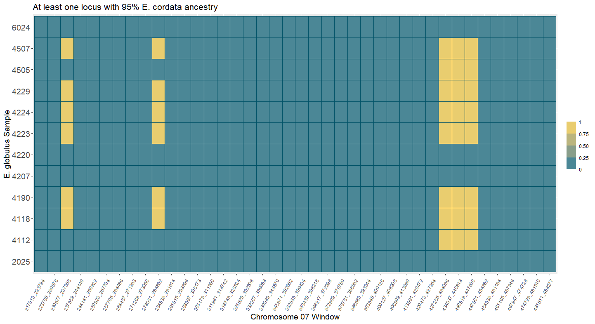


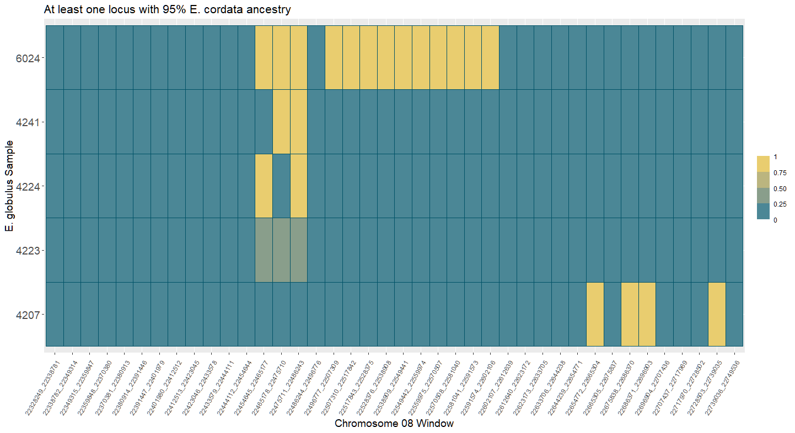

Final intervals to investigate further:

| Chromosome | Start (bp)  | End (bp)    |
| ---------- | ----------- | ----------- |
| Chr06      | 13,159,909  | 13,180,364  |
| Chr07      | 230,577     | 237,358     |
| Chr07      | 278,051     | 284,832     |
| Chr07      | 427,255     | 447,600     |
| Chr07      | 7,074,553   | 7,123,386   |
| Chr08      | 22,454,645  | 22,486,243  |

Intervals for single samples:

| Sample | Chromosome | Start (bp)  | End (bp)    |
| ------ | ---------- | ----------- | ----------- |
| 6024   | Chr08      | 22,496,777  | 22,602,106  |
| 4207   | Chr08      | 22,654,772  | 22,739,035  |

## Test for nonrandomness in distribution of loci across chromosomes and individuals

Performed chi-square test on 5kb windows for Chromosomes 6, 7, and 8 to test for nonrandomness in homozygous regions among windows.

```R
library(ggplot2)
ahmm_in_name <- "C:/Users/Kasey/OneDrive - University of Florida/Grad School Documents/Projects/eucalyptus-hybrid-resequencing/05.analyses/ancestry_hmm/maf00/all_ahmm_in.tab"
ahmm_in <- read.table(ahmm_in_name, sep = "\t", header = FALSE)

# Chromosome 6
chr06_starts <- (5000 * c(1:10428)) + 1
chr06_starts <- c(1, chr06_starts)
chr06_ends <- 5000 * c(1:10428)
chr06_ends <- c(chr06_ends, 52140660)
chr06_5k_tab <- data.frame(chrom = rep("Chr06", length(chr06_starts)), start = chr06_starts, end = chr06_ends)

chr06_5k_to_keep <- unique(unlist(sapply(ahmm_in[which(ahmm_in$V1 == "Chr06"), "V2"], function(x) which(chr06_5k_tab$start <= x & chr06_5k_tab$end >= x)))) # 6051 5kbp windows with at least one informative ahmm variant

chr06_5k_mat_df <- populate_mat(glob_mr_samples, chr06_5k_tab[chr06_5k_to_keep,], 0.95)
label_order <- match(chr06_5k_mat_df$sample, name_table$RAPiD_ID)
chr06_5k_mat_df$acc <- name_table$Accession[label_order]

chr06_5k_pa_mat <- pivot_wider(chr06_5k_mat_df[, c("window", "hom_mat", "acc")], names_from = window, values_from = hom_mat, id_cols = acc)
chr06_5k_contingency <- apply(chr06_5k_pa_mat[,c(2:ncol(chr06_5k_pa_mat))], 2, sum)
chr06_5k_chisq <- chisq.test(chr06_5k_contingency)

# Chromosome 7
chr07_starts <- (5000 * c(1:10851)) + 1
chr07_starts <- c(1, chr07_starts)
chr07_ends <- 5000 * c(1:10851)
chr07_ends <- c(chr07_ends, 54252628)
chr07_5k_tab <- data.frame(chrom = rep("Chr07", length(chr07_starts)), start = chr07_starts, end = chr07_ends)

chr07_5k_to_keep <- unique(unlist(sapply(ahmm_in[which(ahmm_in$V1 == "Chr07"), "V2"], function(x) which(chr07_5k_tab$start <= x & chr07_5k_tab$end >= x)))) #  4090 5kbp windows with at least one informative ahmm variant

chr07_5k_mat_df <- populate_mat(glob_mr_samples, chr07_5k_tab[chr07_5k_to_keep,], 0.95)
label_order <- match(chr07_5k_mat_df$sample, name_table$RAPiD_ID)
chr07_5k_mat_df$acc <- name_table$Accession[label_order]

chr07_5k_pa_mat <- pivot_wider(chr07_5k_mat_df[, c("window", "hom_mat", "acc")], names_from = window, values_from = hom_mat, id_cols = acc)
chr07_5k_contingency <- apply(chr07_5k_pa_mat[,c(2:ncol(chr07_5k_pa_mat))], 2, sum)
chr07_5k_chisq <- chisq.test(chr07_5k_contingency)

# Chromosome 8
chr08_starts <- (10000 * c(1:7022)) + 1
chr08_starts <- c(1, chr08_starts)
chr08_ends <- 10000 * c(1:7022)
chr08_ends <- c(chr08_ends, 70214608)
chr08_5k_tab <- data.frame(chrom = rep("Chr08", length(chr08_starts)), start = chr08_starts, end = chr08_ends)

chr08_5k_to_keep <- unique(unlist(sapply(ahmm_in[which(ahmm_in$V1 == "Chr08"), "V2"], function(x) which(chr08_5k_tab$start <= x & chr08_5k_tab$end >= x)))) # 3925 5kbp windows with at least one informative ahmm variant

chr08_5k_mat_df <- populate_mat(glob_mr_samples, chr08_5k_tab[chr08_5k_to_keep,], 0.95)
label_order <- match(chr08_5k_mat_df$sample, name_table$RAPiD_ID)
chr08_5k_mat_df$acc <- name_table$Accession[label_order]

chr08_5k_pa_mat <- pivot_wider(chr08_5k_mat_df[, c("window", "hom_mat", "acc")], names_from = window, values_from = hom_mat, id_cols = acc)
chr08_5k_contingency <- apply(chr08_5k_pa_mat[,c(2:ncol(chr08_5k_pa_mat))], 2, sum)
chr08_5k_chisq <- chisq.test(chr08_5k_contingency)
```

| Chromosome | df        | chi-square | p-value   |
| ---------- | --------- | ---------- | --------- |
| Chr06      | 6090      | 19591      | 2.2e-16   |
| Chr07      | 4089      | 21944      | 2.2e-16   |
| Chr08      | 3924      | 4415.7     | 4.6e-08   |
