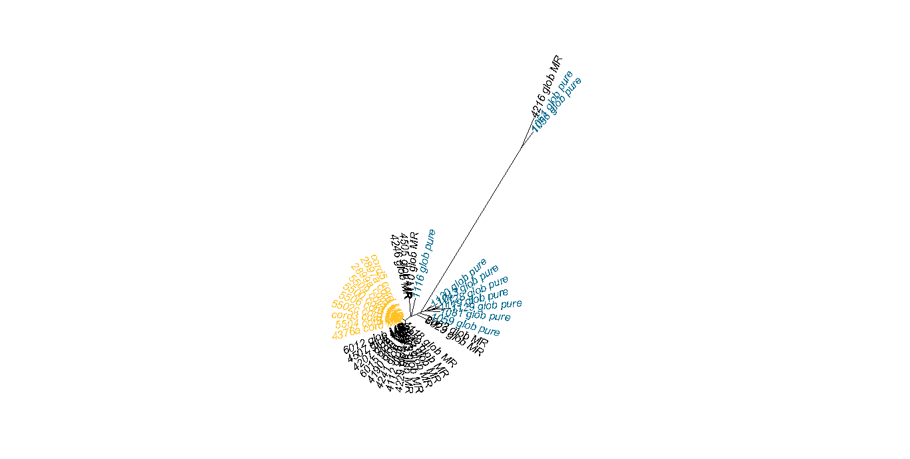

# Chloroplast Haplotype Analysis

## Prepare retrieved assemblies for alignment

Downloaded _Eucalyptus_ chloroplast genome assemblies to include in analysis from NCBI Genbank. See [main project page](https://github.com/kaseykhanhpham/eucalyptus-hybrid-resequencing) for accessions of assemblies used. In short, included assemblies of _E. globulus_, _E. nitens_, _E. viminalis_, _E. grandis_, _E. robusta_, and _E. saligna_.

Ran `FastPlast` just for chloroplast structure identification step to separate the IRB, LSC, and SSC portions for separate alignment.

```bash
# Run on UFRC's queue system; see fastplast_gb.job for more details.
# Resources used: 5 Mb, 10 min

module load fastplast/1.2.8
WDIR="/blue/soltis/kasey.pham/euc_hyb_reseq/analyses/cp_tree/genbank_seqs"
REFS_DIR="/blue/soltis/kasey.pham/euc_hyb_reseq/refs/organelle"
LIST_DIR="/blue/soltis/kasey.pham/euc_hyb_reseq/analyses/cp_tree/genbank_seqs"

while read NAME
do
    mkdir "$WDIR"/"$NAME"
    cd "$WDIR"/"$NAME"
    ln -s "$REFS_DIR"/"$NAME".fasta "$WDIR"/"$NAME"/"$NAME".fasta
    perl $HPC_FASTPLAST_DIR/Fast-Plast/bin/sequence_based_ir_id.pl "$NAME".fasta "$NAME" 3
    $HPC_FASTPLAST_DIR/Fast-Plast/bin/ncbi-blast-2.6.0+/bin/blastn -query "$NAME"_regions_split3.fsa -db  $HPC_FASTPLAST_DIR/Fast-Plast/bin/Angiosperm_Chloroplast_Genes.fsa -evalue 1e-10 -outfmt 6 > "$NAME".split3.blastn
    perl $HPC_FASTPLAST_DIR/Fast-Plast/bin/orientate_plastome_v.2.0.pl "$NAME"_regions_split3.fsa "$NAME".split3.blastn "$NAME"
done < "$LIST_DIR"/euc_plastome_acc_list.txt
```
Created initial alignment files (see below) and visually inspected for sequences that needed reverse-complementing. The following needed to be reverse-complemented:

| Accession   | Regions   |
| ----------- | --------- |


```bash
# E. saligna
SCRIPT_DIR="/blue/soltis/kasey.pham/euc_hyb_reseq"
cd /blue/soltis/kasey.pham/euc_hyb_reseq/cp_assembly/KC180790.1
```

## Get chloroplast alignment

First, created a directory of symlinks to all FASTA sequences to include in the tree.

**Create FASTA files with all chloroplast region assemblies and reformat:**
Wrote python scripts to concatenate chloroplast assemblies from each sample into separate FASTA files for each region and reformat FASTA files to split sequences into multiple lines.

```bash
module load python/3.8
SCRIPTS_DIR="/blue/soltis/kasey.pham/euc_hyb_reseq/scripts"
WDIR="/blue/soltis/kasey.pham/euc_hyb_reseq/analyses/cp_tree"

python "$SCRIPTS_DIR"/make_cp_region_fas.py "$WDIR"/all_tree_samples.txt "$WDIR"/all_tree_seqs
# split each sequence into multiple lines
python "$SCRIPTS_DIR"/reformat_fasta.py 80 irb_temp.fas irb_assemblies.fas
python "$SCRIPTS_DIR"/reformat_fasta.py 80 lsc_temp.fas lsc_assemblies.fas
python "$SCRIPTS_DIR"/reformat_fasta.py 80 ssc_temp.fas ssc_assemblies.fas
rm *_temp.fas
```

**Align chloroplast regions:**
```bash
# Run via job queue on UFRC, see mafft_ssc.job, mafft_irb.job, mafft_lsc.job for more details.
# Resources used: ~500 Mb, 11 min maximum.
# One example of the three regions shown below.

module load mafft/7.490

mafft --auto --thread 16 lsc_assemblies.fas > lsc_assemblies_aligned.fas
```

**Manual editing of alignments:**
* Manually adjusted a few bases among several samples in lsc alignment in `BioEdit`. Saved as `lsc_assemblies_adjusted.fas`
* Manually adjusted a few bases among several samples in ssc alignment in `BioEdit`. Saved as `ssc_assemblies_adjusted.fas`


**Concatenate regions:**
```bash
module load python/3.8
SCRIPTS_DIR="/blue/soltis/kasey.pham/euc_hyb_reseq/scripts"

python "$SCRIPTS_DIR"/concatenate_fasta.py irb_assemblies_aligned.fas,lsc_assemblies_adjusted.fas,ssc_assemblies_adjusted.fas concatenated_cp_aligned.fas
```

## Chloroplast tree

**Phylogenetic analysis in [`IQTree`](http://www.iqtree.org/):**
```bash
# Run via job queueing in UFRC; see iqtree.job for more details
# Resources: 2 Mb, 15 sec

module load iq-tree/2.1.3
WDIR="/blue/soltis/kasey.pham/euc_hyb_reseq/analyses/cp_tree"

iqtree -s "$WDIR"/concatenated_cp_aligned.fas -st DNA -B 1000 -m MFP -nt 12 -pre concatenated_cp_aligned
```

**Plot phylogeny in `R`:**

```R
# Done on local computer
library(ape)
# init file names
meta_name <- "C:/Users/Kasey/OneDrive - University of Florida/Grad School Documents/Projects/eucalyptus-hybrid-resequencing/00.metadata/03.seq_analysis/sample_spp_table.csv"
cp_hap_meta_name <- "C:/Users/Kasey/OneDrive - University of Florida/Grad School Documents/Projects/eucalyptus-hybrid-resequencing/00.metadata/01.field_sampling/40samples_KaseyUF_updateDec2020.csv"
intree_name <- "concatenated_cp_aligned.treefile"

# read in files
meta_table <- read.csv(meta_name, header = TRUE, as.is = TRUE)
cp_table <- read.csv(cp_hap_meta_name, header = TRUE, as.is = TRUE)
intree <- read.tree(intree_name)

# add outgroup labels
meta_table <- rbind(meta_table, c("HM347959.1", "", "E. grandis"))
meta_table <- rbind(meta_table, c("KC180790.1", "", "E. saligna"))

# replace tip names
label_order <- match(intree$tip.label, meta_table$RAPiD_ID)
cp_order <- match(meta_table[label_order, "Accession"], cp_table$RJgeno)
replacemt_labels <- paste(meta_table[label_order, "Accession"], meta_table[label_order, "Taxon"], cp_table[cp_order, "JLA."], sep = "_")
intree$tip.label <- replacemt_labels

# root tree
intree <- root(intree, c("E. grandis__NA"), resolve.root = TRUE)

# plot tree
tip_colors <- sapply(meta_table[label_order, "Taxon"], function(x) ifelse(x == "cord_MR", "goldenrod1", ifelse(x == "glob_MR", "black", "deepskyblue4")))

plot(intree, tip.color = tip_colors, cex = 1, show.node.label = TRUE, adj = 1, align.tip.label = TRUE)
```

