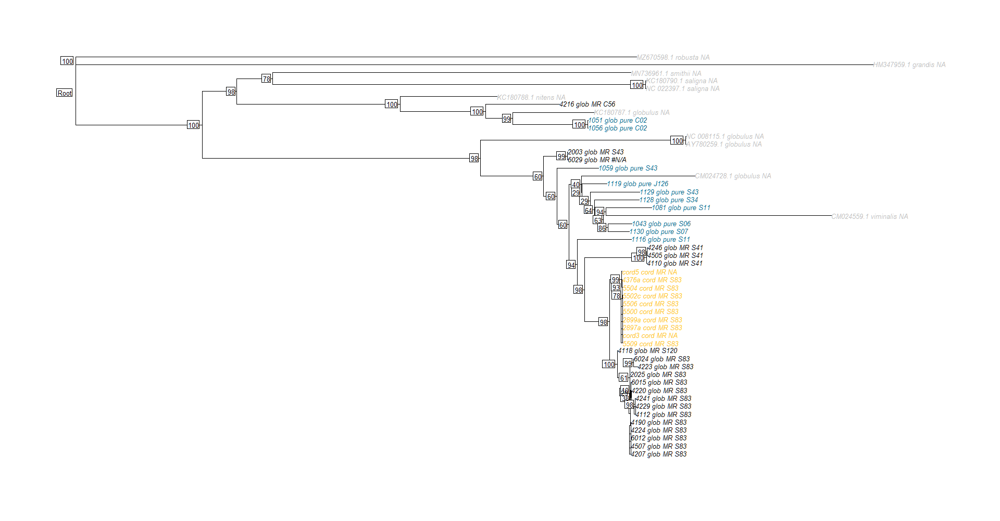
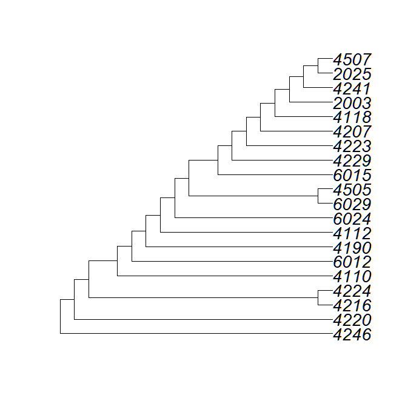

# Chloroplast Haplotype Analysis

## Prepare retrieved assemblies for alignment

Downloaded _Eucalyptus_ chloroplast genome assemblies to include in analysis from NCBI Genbank. See [main project page](https://github.com/kaseykhanhpham/eucalyptus-hybrid-resequencing) for accessions of assemblies used. In short, included assemblies of _E. globulus_, _E. nitens_, _E. viminalis_, _E. grandis_, _E. robusta_, and _E. saligna_.

Because they were downloaded manually from NCBI, converted from DOS to Unix encoding.
```bash
PLASTDIR="/blue/soltis/kasey.pham/euc_hyb_reseq/refs/organelle"

cd "$PLASTDIR"
ls *.fasta | while read FILE; do dos2unix "$FILE"; done
```

For any assemblies with chloroplast structure already annotated, retrieved a BED file for structural features from NCBI. Used the annotation to extract structural features separately for alignment in `BEDTools`.

```bash
module load bedtools/2.30.0
WDIR="/blue/soltis/kasey.pham/euc_hyb_reseq/analyses/cp_tree/genbank_seqs"
REFS_DIR="/blue/soltis/kasey.pham/euc_hyb_reseq/refs/organelle"

declare -a ANNOT_ACC=(AY780259.1 HM347959.1 KC180787.1 KC180788.1 KC180790.1 MZ670598.1 NC_008115.1 NC_022395.1 NC_022397.1)

for ACC in "${ANNOT_ACC[@]}"
do
    cd "$WDIR"/"$ACC"
    bedtools getfasta -nameOnly -fo "$ACC"_CP_pieces.fsa -fi "$REFS_DIR"/"$ACC"/"$ACC".fasta -bed "$REFS_DIR"/"$ACC"/"$ACC".bed
done
```

For any NCBI plastome assemblies without an annotation, ran `FastPlast` just for assembly finishing step to identify the IRB, LSC, and SSC portions for separate alignment. Did not automate because `sequence_based_ir_id.pl` should be run for several values and the best result picked.

```bash
module load fastplast/1.2.8
WDIR="/blue/soltis/kasey.pham/euc_hyb_reseq/analyses/cp_tree/genbank_seqs"
REFS_DIR="/blue/soltis/kasey.pham/euc_hyb_reseq/refs/organelle"
LIST_DIR="/blue/soltis/kasey.pham/euc_hyb_reseq/analyses/cp_tree/genbank_seqs"

# CM024559.1
cd "$WDIR"/CM024559.1
ln -s "$REFS_DIR"/CM024559.1.fasta
# run script to identify putative structural features
for NUM in 0 1 2 3
do
    perl "$HPC_FASTPLAST_DIR"/Fast-Plast/bin/sequence_based_ir_id.pl CM024559.1.fasta CM024559.1 "$NUM"
done
# removed extra IR in final chosen split file: CM024559.1_regions_split0.fsa
# blast to database and orientate
"$HPC_FASTPLAST_DIR"/Fast-Plast/bin/ncbi-blast-2.6.0+/bin/blastn -query CM024559.1_regions_split0.fsa -db  $HPC_FASTPLAST_DIR/Fast-Plast/bin/Angiosperm_Chloroplast_Genes.fsa -evalue 1e-10 -outfmt 6 > CM024559.1.split0.blastn
perl $HPC_FASTPLAST_DIR/Fast-Plast/bin/orientate_plastome_v.2.0.pl CM024559.1_regions_split0.fsa CM024559.1.split0.blastn CM024559.1

# CM024728.1
cd "$WDIR"/CM024728.1
ln -s "$REFS_DIR"/CM024728.1.fasta
# run script to identify putative structural features
for NUM in 0 1 2 3
do
    perl "$HPC_FASTPLAST_DIR"/Fast-Plast/bin/sequence_based_ir_id.pl CM024728.1.fasta CM024728.1 "$NUM"
done
# removed extra IR in final chosen split file: CM024728.1_regions_split0.fsa
# blast to database and orientate
"$HPC_FASTPLAST_DIR"/Fast-Plast/bin/ncbi-blast-2.6.0+/bin/blastn -query CM024728.1_regions_split0.fsa -db  $HPC_FASTPLAST_DIR/Fast-Plast/bin/Angiosperm_Chloroplast_Genes.fsa -evalue 1e-10 -outfmt 6 > CM024728.1.split0.blastn
perl $HPC_FASTPLAST_DIR/Fast-Plast/bin/orientate_plastome_v.2.0.pl CM024728.1_regions_split0.fsa CM024728.1.split0.blastn CM024728.1

# MN736961.1
cd "$WDIR"/MN736961.1
ln -s "$REFS_DIR"/MN736961.1.fasta
for NUM in 0 1 2 3
do
    perl "$HPC_FASTPLAST_DIR"/Fast-Plast/bin/sequence_based_ir_id.pl MN736961.1.fasta MN736961.1 "$NUM"
done
# removed extra IR in final chosen split file: MN736961.1_regions_split0.fsa
"$HPC_FASTPLAST_DIR"/Fast-Plast/bin/ncbi-blast-2.6.0+/bin/blastn -query MN736961.1_regions_split0.fsa -db  $HPC_FASTPLAST_DIR/Fast-Plast/bin/Angiosperm_Chloroplast_Genes.fsa -evalue 1e-10 -outfmt 6 > MN736961.1.split0.blastn
perl $HPC_FASTPLAST_DIR/Fast-Plast/bin/orientate_plastome_v.2.0.pl MN736961.1_regions_split0.fsa MN736961.1.split0.blastn MN736961.1
```
Created initial alignment files (see below) and visually inspected for sequences that needed reverse-complementing. The following needed to be reverse-complemented:

| Accession   | Regions     |
| ----------- | ----------- |
| CM024728.1  | lsc         |

```bash
module load biopieces/2.0
WDIR="/blue/soltis/kasey.pham/euc_hyb_reseq/analyses/cp_tree/genbank_seqs"

# CM024728.1
cd "$WDIR"/CM024728.1
mkdir $BP_DATA $BP_TMP $BP_LOG
mv CM024728.1_CP_pieces.fsa CM024728.1_CP_pieces_raw.fsa
# reverse complement just the specified entries
read_fasta -i CM024728.1_CP_pieces_raw.fsa | grab -p lsc | reverse_seq | complement_seq | write_fasta -x -o CM024728.1_CP_pieces.fsa
# extract the specified entries as-is
read_fasta -i CM024728.1_CP_pieces_raw.fsa | grab -p ssc,irb | write_fasta -x -o temp.fsa
# merge reverse-complemented sequences with the untouched sequences
cat temp.fsa >> CM024728.1_CP_pieces.fsa
rm temp.fsa
```

## Get chloroplast alignment

First, created a directory of symlinks to all FASTA sequences to include in the tree.

**Create FASTA files with all chloroplast region assemblies and reformat:**
Wrote python scripts to concatenate chloroplast assemblies from each sample into separate FASTA files for each region and reformat FASTA files to split sequences into multiple lines.

```bash
module load python/3.8
SCRIPTS_DIR="/blue/soltis/kasey.pham/euc_hyb_reseq/scripts"
WDIR="/blue/soltis/kasey.pham/euc_hyb_reseq/analyses/cp_tree"

python "$SCRIPTS_DIR"/make_cp_region_fas.py "$WDIR"/all_tree_samples.txt "$WDIR"/all_tree_seqs
# split each sequence into multiple lines
python "$SCRIPTS_DIR"/reformat_fasta.py 80 irb_temp.fas irb_assemblies.fas
python "$SCRIPTS_DIR"/reformat_fasta.py 80 lsc_temp.fas lsc_assemblies.fas
python "$SCRIPTS_DIR"/reformat_fasta.py 80 ssc_temp.fas ssc_assemblies.fas
rm *_temp.fas
```

**Align chloroplast regions:**
```bash
# Run via job queue on UFRC, see mafft.job for more details.
# Resources used: 600 Mb, 8 min

module load mafft/7.490

mafft --auto --thread 16 irb_assemblies.fas > irb_assemblies_aligned.fas
mafft --auto --thread 16 ssc_assemblies.fas > ssc_assemblies_aligned.fas
mafft --auto --thread 16 lsc_assemblies.fas > lsc_assemblies_aligned.fas
```

Manually replaced ambiguity codes with "N" as `TrimAl` cannot handle them. 

**Trim alignments:**

Used `TrimAl` to remove low-coverage sites of the alignment.
```bash
module load trimal/1.4.1
WDIR="/blue/soltis/kasey.pham/euc_hyb_reseq/analyses/cp_tree"

cd "$WDIR"
trimal -in irb_assemblies_aligned.fas -out irb_assemblies_trimmed.fas -gt 0.6
trimal -in ssc_assemblies_aligned.fas -out ssc_assemblies_trimmed.fas -gt 0.6
trimal -in lsc_assemblies_aligned.fas -out lsc_assemblies_trimmed.fas -gt 0.6
```

Made very minor manual adjustments to LSC before concatenating in `BioEdit`.

**Concatenate regions:**
```bash
module load python/3.8
SCRIPTS_DIR="/blue/soltis/kasey.pham/euc_hyb_reseq/scripts"

python "$SCRIPTS_DIR"/concatenate_fasta.py irb_assemblies_trimmed.fas,lsc_assemblies_trimmed.fas,ssc_assemblies_trimmed.fas concatenated_cp_aligned.fas
```

## Chloroplast tree

**Phylogenetic analysis in [`IQTree`](http://www.iqtree.org/):**
```bash
# Run via job queueing in UFRC; see iqtree.job for more details
# Resources: 2 Mb, 1 min

module load iq-tree/2.1.3
WDIR="/blue/soltis/kasey.pham/euc_hyb_reseq/analyses/cp_tree"

iqtree -s "$WDIR"/concatenated_cp_aligned.fas -st DNA -B 1000 -m MFP -nt 12 -pre concatenated_cp_aligned
```

**Plot phylogeny in `R`:**

```R
# Done on local computer
library(ape)
# init file names
meta_name <- "C:/Users/Kasey/OneDrive - University of Florida/Grad School Documents/Projects/eucalyptus-hybrid-resequencing/00.metadata/03.seq_analysis/sample_spp_table.csv"
cp_hap_meta_name <- "C:/Users/Kasey/OneDrive - University of Florida/Grad School Documents/Projects/eucalyptus-hybrid-resequencing/00.metadata/01.field_sampling/40samples_KaseyUF_updateDec2020.csv"
intree_name <- "concatenated_cp_aligned.treefile"

# read in files
meta_table <- read.csv(meta_name, header = TRUE, as.is = TRUE)
cp_table <- read.csv(cp_hap_meta_name, header = TRUE, as.is = TRUE)
intree <- read.tree(intree_name)

# add NCBI plastome labels
assemb_acc <- c("AY780259.1", "KC180787.1", "CM024728.1", "NC_008115.1", "NC_022395.1", "KC180788.1", "CM024559.1", "MN736961.1", "HM347959.1", "MZ670598.1", "KC180790.1", "NC_022397.1")
assemb_tax <- c("globulus", "globulus",  "globulus","globulus", "nitens", "nitens", "viminalis", "smithii", "grandis", "robusta", "saligna", "saligna")

to_add_to_samples <- cbind(assemb_acc, assemb_tax, assemb_acc)
colnames(to_add_to_samples) <- c("RAPiD_ID", "Taxon", "Accession")
meta_table <- rbind(meta_table, to_add_to_samples)

# replace tip names
label_order <- match(intree$tip.label, meta_table$RAPiD_ID)
cp_order <- match(meta_table[label_order, "Accession"], cp_table$RJgeno)
replacemt_labels <- paste(meta_table[label_order, "Accession"], meta_table[label_order, "Taxon"], cp_table[cp_order, "JLA."], sep = "_")
intree$tip.label <- replacemt_labels

# root tree
intree_rooted <- root(intree, c("MZ670598.1_robusta_NA", "HM347959.1_grandis_NA"), resolve.root = TRUE)

write.tree(intree_rooted, "rooted_euc_mr_cp.tre")

# plot tree
tip_colors <- sapply(meta_table[label_order, "Taxon"], function(x) ifelse(x == "cord_MR", "goldenrod1", ifelse(x == "glob_MR", "black", (ifelse(x == "glob_pure", "deepskyblue4", "darkgray")))))

png("cp_tree_no_nodes.png", height = 1600, width = 2400)
plot(intree_rooted, tip.color = tip_colors, cex = 1.5 , edge.width = 2, root.edge = TRUE, label.offset = 0.000005)
add.scale.bar()
nodelabels(intree_rooted$node.label, adj = c(1.25), cex = 0.50, bg = "white")
dev.off()

# for talk
library(ggtree)
intree_collapsed <- as.polytomy(intree, feature = 'node.label', fun = function(x) as.numeric(x) < 85)
intree_collapsed_rooted <- root(intree_collapsed, c("MZ670598.1_robusta_NA", "HM347959.1_grandis_NA"), resolve.root = TRUE)
plot(intree_collapsed_rooted, show.tip.label = FALSE, cex = 1.25 , edge.width = 1.5, root.edge = TRUE, label.offset = 0.000005)
add.scale.bar()
tip_pch <- sapply(meta_table[label_order, "Taxon"], function(x) ifelse(x == "cord_MR", 15, ifelse(x == "glob_MR", 19, (ifelse(x == "glob_pure", 17, 18)))))
tip_cex <- ifelse(tip_pch == 15, 1, 1.25)
tiplabels(pch = tip_pch, cex = tip_cex)
```



Calculated date to capture of S83 in _E. globulus_ from _E. cordata_. Used the general seed plant chloroplast substitution rate, 1.01 x 10^-9 substitutions per site per year.

Branch length from _E. globulus_ S83 to the last common ancestor with _E. cordata_ S83: 0.0000376547 substitutions per site.

Years to capture: 37,282 years

## UPGMA tree of nuclear data
Created a pairwise distance matrix for number of allele differences between samples for linkage-pruned SNPs in `PLINK`.

```bash
# Done in UFRC queue system; see dist_mat.job for more details.
# Resources used: 11 Mb, 2 min

module load plink/1.90b3.39 

VCF="/blue/soltis/kasey.pham/euc_hyb_reseq/call_snps/04.filter_snps/all_fil.vcf.gz"
LD_DIR_00="/blue/soltis/kasey.pham/euc_hyb_reseq/analyses/wg_pca/maf0.00"
LD_DIR_05="/blue/soltis/kasey.pham/euc_hyb_reseq/analyses/wg_pca/maf0.05"
OUTDIR="/blue/soltis/kasey.pham/euc_hyb_reseq/analyses/trees/nucl_upgma'

plink --vcf "$VCF" --double-id --allow-extra-chr --set-missing-var-ids @:# --extract "$LD_DIR_00"/all_maf00.prune.in --vcf-half-call m --make-bed --distance --out "$OUTDIR"/maf00
plink --vcf "$VCF" --double-id --allow-extra-chr --set-missing-var-ids @:# --extract "$LD_DIR_05"/all_maf05.prune.in --vcf-half-call m --maf 0.05 --make-bed --distance --out "$OUTDIR"/maf05
```

Calculated relatedness between individuals using relatedness statistic from [Manichaikul et al. 2010 _Bioinformatics_](https://doi.org/10.1093/bioinformatics/btq559), calculated in `vcftools`.

```bash
# Done in UFRC queue system; see vcft_dist.job for more details.
# Resources used: 5 Mb, 2 min

module load vcftools/0.1.16 

IN_DIR="/blue/soltis/kasey.pham/euc_hyb_reseq/call_snps/04.filter_snps"
POPLIST_DIR="/blue/soltis/kasey.pham/euc_hyb_reseq/analyses/ancestry_hmm"
WDIR="/blue/soltis/kasey.pham/euc_hyb_reseq/analyses/trees/nucl_upgma"

# maf = 0.00
vcftools --gzvcf "$IN_DIR"/all_fil.vcf.gz --out "$WDIR"/maf00/globMR_maf00 --keep "$POPLIST_DIR"/Eglobulus_MR.txt --min-alleles 1 --max-alleles 2 --relatedness2

# maf = 0.05
vcftools --gzvcf "$IN_DIR"/all_fil.vcf.gz --out "$WDIR"/maf05/globMR_maf05 --keep "$POPLIST_DIR"/Eglobulus_MR.txt --min-alleles 1 --max-alleles 2 --maf 0.05 --relatedness2
```

Generated UPGMA tree from distance matrix in the `R` package `phangorn`.

```R
library(phangorn)
library(ape)

wdir <- "C:/Users/Kasey/OneDrive - University of Florida/Grad School Documents/Projects/eucalyptus-hybrid-resequencing/05.analyses/trees/nucl_upgma/"
infile_name <- "globMR_maf00.relatedness2"

setwd(wdir)

# create distance matrix
dist_df <- read.table(infile_name, header = TRUE, sep = "\t")
non_diag_rows <- which(dist_df[,1] != dist_df[,2])
dist_df_pruned <- dist_df[non_diag_rows,]
# https://stackoverflow.com/questions/22492767/converting-pairwise-distances-into-a-distance-matrix-in-r 
dist_mat <- as.dist(xtabs(dist_df_pruned[, 7] ~ dist_df_pruned[, 2] + dist_df_pruned[, 1])) 

# create upgma object
nucl_upgma <- upgma(dist_mat, method = "average")
# rename tips
meta_name <- "C:/Users/Kasey/OneDrive - University of Florida/Grad School Documents/Projects/eucalyptus-hybrid-resequencing/00.metadata/03.seq_analysis/sample_spp_table.csv"
meta_table <- read.csv(meta_name, header = TRUE, as.is = TRUE)
label_order <- match(nucl_upgma$tip.label, meta_table$RAPiD_ID)
nucl_upgma_renamed <- nucl_upgma
nucl_upgma_renamed$tip.label <- meta_table$Accession[label_order]

# plot in ape
plot(nucl_upgma_renamed, cex = 1.75, use.edge.length = FALSE)
```

